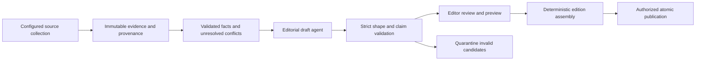

# Agent-assisted editorial workflow

Use the same [authoring templates](authoring-guide.md) for people and agents. Begin by automating candidate drafts. Production collection, evidence normalization, ranking, review transitions, and publication belong to delivery milestones B–G and are not implemented by these documents.

## What works now and what is proposed

| Today | Still needed for unattended operation |
| --- | --- |
| Separate validated fixture and production JSON/Markdown loaders | Collection, candidate assembly, and publication automation |
| Local preview, build, unit/browser tests, internal link checks | Source collectors with preserved snapshots and field-level provenance |
| Manual choice of lead, sections, and fixture signal values | Versioned deterministic ranking and attributed overrides |
| Draft assignment and JSON output schema in this kit | Enforced agent boundary, output validator, factual claim checks, quarantine |
| Manual comparison of prose and sources | Recorded review identity/state, corrections, atomic publication and rollback |

The new JSON output schema is a **proposed handoff contract**, stored with the templates. The running site does not consume or enforce it. A prompt is guidance, not a permission boundary. Production records live in separate directories, require published and review metadata, and cannot be enabled by changing fixture flags.

## Proposed flow

These are responsibilities; they do not require eight agents. Prefer deterministic collectors/validators/assembly, with an agent used for editorial drafting. A no-model path must remain possible.

## 1. Evidence packet: read-only input to the drafter

Start with [evidence-record.json](templates/evidence-record.json). It is a proposed sidecar format, not current edition JSON. Each claim needs:

- A stable claim ID, entity/field name, typed value or `null`, and status.
- Source ID, canonical HTTP(S) URL, actual retrieval time, source publication/data date or version when available.
- Snapshot path and hash when collected; keep exact source statements or bounded excerpts needed to verify the claim.
- Any conflicting candidates and the explicit authority rule used to resolve them. Unresolved conflicts remain unresolved.

For CVEs, keep CVSS score/version/vector, EPSS probability, percentile, KEV membership, confirmed exploitation, PoC availability, affected range, and fixes as separate claims. The prototype story model cannot represent all these dimensions; preserve the richer evidence rather than squeezing it into a single label.

Collectors must constrain protocols, destinations, redirects, timeouts, and response sizes. Preserve the last good input on failure and record freshness truthfully. Evidence acquisition and schema enforcement are future implementation, not guarantees supplied by the sidecar template.

## 2. Draft assignment and output

Copy [agent-assignment.md](templates/agent-assignment.md) and provide the audience, type, structure, approved evidence, citation IDs, and output location. Keep candidates outside auto-loaded directories, such as `/private/tmp/tsd-editorial-drafts/<request-id>/`. That scratch location is not durable audit storage; archive reviewed artifacts in the later pipeline's evidence/draft store.

Expected output is [agent-draft.json](templates/agent-draft.json), validated against [agent-draft.schema.json](templates/agent-draft.schema.json). This v1 proposal permits only:

- `schema_version`
- `title`, `summary`, `why_it_matters`, `action`, `body_markdown`
- `claim_links`: exact drafted text with supporting evidence claim IDs
- `open_questions`: unresolved gaps for the editor

Classification can be a separate suggestion later. This initial contract leaves category/tags and placement with the editor to avoid coupling prose generation to publication decisions.

The agent must not supply authoritative facts, evidence timestamps/URLs, identity, signal, author/review identity, or fixture/publication flags. Do not merge model JSON into a Story with object spread. The integrator copies each approved editorial field explicitly and attaches locked facts from the validated evidence store.

`additionalProperties: false` in the proposed output schema rejects extra keys. The existing Zod story schema is not a strict agent boundary: unknown-key stripping does not establish that a malicious output was rejected, and allowlisted prose can still contain fabricated facts.

## 3. Validation before integration

The future validator must check all of the following, not just parse JSON:

1. **Shape and size:** pinned schema/version, unknown keys rejected, bounded strings/arrays, no embedded executable markup or unsafe links.
2. **Evidence membership:** claim/citation IDs exist in the supplied packet; no agent-generated URL or source identity becomes authoritative.
3. **Factual consistency:** every material claim in title, summary, impact, action, and body agrees with evidence. A numeric scan alone cannot catch a fabricated causal or affected-scope claim.
4. **Uncertainty and attribution:** conflicts, nulls, historical context, source dates, generated-copy status, and actual author/reviewer identity remain truthful.
5. **Identity and placement:** no duplicate/conflicting IDs/slugs, orphaned sections, mismatched Markdown titles, broken related IDs, or misleading lead artwork.
6. **Review and publication:** a schema-valid draft remains a draft. Only recorded authorized review can move it onward; a draft must not leak into routes or feeds.

Reject or quarantine failures with actionable reasons. Do not silently replace a failed claim with zero/false, mark it reviewed, or discard the previous edition. Check that footnote definitions and return links actually render; today's regex matching is not a complete citation integrity check.

## 4. Trust boundaries and retries

| Actor | May write | Must not decide |
| --- | --- | --- |
| Collector | Its own raw snapshots and retrieval metadata | Editorial claims or publication |
| Normalizer/enricher | Validated facts with field-specific authority rules | Unsupported guesses or prose-driven fact overrides |
| Drafting agent | Candidate editorial JSON in a constrained draft location | Filesystem permissions, source authority, review, or deployment |
| Editor | Approved prose, classification, placement, actual review record | Silent rewriting of historical facts |
| Assembler/publisher | Validated edition/artifact for an authorized release | Fresh facts from the browser or new model claims |

Enforce write scope with tool/filesystem permissions. Keep credentials out of prompts and evidence packets. Record request ID, evidence hashes, prompt/schema/provider version, outputs, validation outcomes, and actual review outside reader-facing content. Use stable IDs for reruns, bounded retries and cost limits, one publisher per edition, and atomic promotion with a verified rollback artifact.

## 5. Minimum adversarial acceptance cases

Before automatic integration, require tests that reject an extra `vulnerabilities` key, a changed `fixture` flag, an invented fixed version inside `action`, a nonexistent claim ID, a citation with no definition, raw HTML/script markup, and an instruction embedded in a source. Include conflicting scores, missing KEV data, stale evidence, provider outage, empty collector input, duplicate slug across editions, and retrying the same request twice.

Expected result: quarantine with reasons, unchanged authoritative facts, and the last good edition retained. Production fixture/draft rejection and no-model operation remain required gates.

## 6. Sensible implementation order

1. Use the templates manually and refine the editorial recipes against real reviewed candidates.
2. Add a local draft scaffolder and discovery/validation of draft files; replace hardcoded lead artwork with validated per-story assets or a prose-only option.
3. Implement evidence collection/provenance and a production-capable versioned content contract with cross-language validation.
4. Wire the strict agent-output boundary and adversarial tests. First deliver candidates for review, without publishing permissions.
5. Add recorded editorial approval, immutable editions/corrections, and authorized atomic publication.

This sequence keeps automation compatible with the current content model while addressing known gaps. It does not choose an AI provider, purchase a service, schedule jobs, or authorize deployment.
