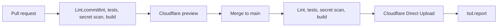

# The Security Diff Production Deployment Implementation Plan

> **For agentic workers:** REQUIRED SUB-SKILL: Use `superpowers:subagent-driven-development` (recommended) or `superpowers:executing-plans` to implement this plan task by task. Steps use checkbox (`- [ ]`) syntax for tracking.

**Goal:** Establish a reviewable preview environment and a fail-closed, approval-gated path that publishes reviewed, non-fixture static builds to `https://tsd.report` through GitHub Actions and Cloudflare Pages.

**Architecture:** GitHub Actions remains the policy and release control plane. Pull requests produce archived static artifacts for an isolated, non-indexable preview project. A privileged workflow treats every downloaded pull-request artifact as untrusted: trusted default-branch code validates its archive entries, rejects executable/runtime output, replaces deployment policy files with trusted copies, and only then uploads it. Production releases build a named Git commit with `CONTENT_MODE=production`, run separate production browser tests, archive and retain the exact verified bytes, rehearse those bytes on a non-indexable staging destination, exercise rollback, and request authorization for that digest and the DNS change. Only the authorized archive is uploaded to the production project; post-cutover failure invokes an explicit rollback to the recorded prior Cloudflare deployment or retained artifact. Scheduled collection creates a reviewable candidate pull request and never publishes directly.

**Tech Stack:** Astro 7 static output, Node.js 22.12+, npm, TypeScript, Vitest, Playwright, GitHub Actions, Cloudflare Pages Direct Upload, Wrangler CLI, Cloudflare DNS and CDN.

**Spec:** [product specification](../../../the-security-diff-implementation-spec.md), [design baseline](../specs/2026-09-26-tsd-design.md), [delivery plan Milestone G](2026-09-26-tsd-delivery.md), [repository rules](../../../AGENTS.md).

### 2026-09-27 release automation decision and implementation boundary

The user selected **semantic-release** for automatic SemVer tags and GitHub Releases after eligible changes merge to `main`. The target chain is successful Validate → Security → GitHub Release → production-only build → retained archive → isolated staging and recovery rehearsal → publication authorization → Cloudflare upload and post-deployment verification. `release.yml` calls reusable `deploy.yml` directly; it does not rely on a release event generated by `GITHUB_TOKEN`.

The [release-process runbook](../../operations/release-process.md) records version rules, pinned tooling, activation variables/secrets, retries, command contracts, and current limitations. Workflow definitions exist locally for validation, preview, security, release, deployment, and daily candidates. **Production and candidate deployment remain blocked by missing implementations; no public release or DNS change has occurred.** Existing task checkboxes still require real evidence before completion.

The [content-environments design](../../design/content-environments.md) is a prerequisite: production selects only reviewed `data/production/editions` and `content/production/articles`, rejects empty/draft/fixture content, and never falls back to seed examples. The deployment profile now requires `build:production`, `validate:production`, and `test:content-environments`. A holding page requires a separate explicitly approved path.

Initial public launch retains exact-artifact and DNS authorization. The requested steady-state target is automatic promotion after reviewed merges, under a recorded standing publication policy checked for every artifact. Until that policy is implemented and recorded, `TSD_PROMOTION_POLICY_MODE=approval` and the protected production environment require per-release approval. The future `post-merge` policy cannot authorize new domains, DNS changes, unreviewed content, or fixture/empty publication. Remote authorization settings have not been changed.

GitHub Release assets retain verified production archives beyond Actions' 90-day expiry, with unique run/attempt names and no overwrite. The minimum-two-successful-releases retention requirement remains an inventory gate. Production policy files must be included before packing and compared after download; replacing them after packaging would violate exact-byte promotion.

## Global constraints

- `/article/[slug]` remains the canonical route for every story type.
- Astro remains a static build with output in `dist/`; do not add a server adapter for this deployment.
- `https://tsd.report` is the canonical origin and trailing slashes remain disabled.
- Fixture previews use `CONTENT_MODE=fixture`, display the fixture banner, and remain `noindex`.
- Candidate previews render the pull request's candidate content with an honest draft/review label and remain `noindex`; candidate selection is independent of production eligibility.
- Production builds use `CONTENT_MODE=production` and fail if any fixture, synthetic, draft, or unreviewed publication record enters the build.
- The first hosted deployment is a preview URL. Do not attach `tsd.report` until the public release gate passes.
- Build once, package every file in a deterministic archive, retain its digest, and deploy the same verified bytes after approval. Do not rebuild between rehearsal, approval, and production deployment.
- A failed candidate or staging check must leave production untouched. A failed post-deployment check must restore and verify the recorded prior production deployment or retained archive; stopping the workflow is not rollback.
- Scheduled automation creates a content pull request. It does not merge or deploy generated security content.
- Keep workflow permissions read-only unless a job requires a narrower additional permission.
- Pin every GitHub Action to a full commit SHA and record the human-readable release in a comment.
- Store Cloudflare credentials in GitHub environments. Never commit account IDs, API tokens, contacts, or private deployment URLs.
- Preserve permanent edition URLs, feed URLs, canonical metadata, source attribution, evidence dates, and explicit unknown states.
- Initial public publication requires explicit user authorization for one exact archive digest and proposed DNS/domain changes after preview, pre-release evidence, security controls, and rollback rehearsal are reviewable. Subsequent promotion follows the recorded policy described above; no standing authorization currently exists.

---

## 1. Current state and blockers

The repository is already structured well for static deployment:

- `astro.config.mjs` sets `site: 'https://tsd.report'`, `output: 'static'`, and `trailingSlash: 'never'`.
- `npm run build` produces 61 static pages under `dist/`.
- `.github/workflows/validate.yml` runs type checks, unit tests, fixture validation, a fixture build, internal-link checks, and Playwright.
- The fixture UI is visibly marked and emits `noindex`.
- `npm run build:production` currently fails with `Production content requires at least one reviewed edition` because the isolated production corpus is empty.

The following conditions block a public production release:

1. The local repository has no Git remote configured.
2. The current Milestone A implementation is uncommitted.
3. Current editions and sample articles are fixtures or unreviewed editorial prototypes.
4. The public security contact is unconfirmed, so `security.txt` cannot truthfully be created.
5. Production response headers and canonical-host redirects are not configured.
6. A deployment project, scoped Cloudflare credentials, GitHub environments, domain access, and branch protection are not configured.
7. Production content generation, editorial approval, failed-run retention, and rollback have not been exercised.
8. The full public V1 release gate in the delivery plan remains incomplete.

The first deliverable from this plan is therefore a hosted fixture preview, followed by a production-capable pipeline that continues to reject fixture content until reviewed data exists.

### Review feedback incorporated in this revision

| Review finding | Resolution in this plan |
| --- | --- |
| Public cutover preceded authorization/security/rollback | Tasks are ordered as preview, content prerequisites, security, staging rehearsal, rollback rehearsal, exact release authorization, then public cutover. |
| Failed production smoke did not restore the prior release | Task 14 records the prior deployment before upload and requires verified rollback on provider or post-cutover failure. |
| Privileged preview trusted PR output | Tasks 2, 3, and 5 use an archive plus trusted default-branch verifier, reject runtime/unsafe entries, inject trusted policy files, and deploy to an isolated preview project. |
| Content mode conflicted with indexing policy | Task 7 models `contentMode` and `visibility` separately and allowlists destinations. Production content remains `noindex` on every provider/staging host. |
| Production browser gate included fixture assertions | Task 9 defines separate fixture and production Playwright configurations and manifest-driven production routes. |
| Rollback rebuilt an old commit | Task 12 restores a Cloudflare deployment or retained archive by identity/digest; rebuild is only a separately verified fallback. |
| Hidden files could disappear from GitHub artifacts | Task 3 archives `dist/` before upload and verifies `.well-known/security.txt` plus the complete file manifest after download. |
| Markdown output path was wrong | Task 2 verifies the extensionless `dist/markdown`; Task 6 and hosted smoke checks require the intended Markdown content type. |
| Stable fonts/textures had unsafe immutable caching | Task 6 revalidates stable-name assets and reserves immutable caching for content-hashed Astro assets. |
| Candidate previews were undefined | Task 8 selects the submitted candidate independently of publication eligibility and displays honest draft/review labels under `noindex`. |

## 2. Hosting options and decision

| Option | Advantages | Tradeoffs | Decision |
| --- | --- | --- | --- |
| Cloudflare Pages Direct Upload through GitHub Actions | Static CDN, preview branches, custom headers, custom domain, low operational cost, exact-artifact deployment, CI owns the release gate | Requires a Pages project, scoped API token, account ID, and explicit workflows | **Selected** |
| Cloudflare Pages Git integration | Fast setup, automatic branch and pull-request previews | Provider rebuilds separately; a Git-integrated Pages project cannot later switch to Direct Upload | Declined for production control |
| Vercel Git integration | Zero-configuration static Astro deployment, automatic previews, simple rollback and domain management | Hobby is limited to personal noncommercial use; production checks and billing need plan review | Supported alternative |
| Cloudflare Workers Static Assets | Cloudflare's preferred path for new applications and leaves room for Workers, KV, D1, or runtime features | More platform configuration than the current static site needs | Reconsider if runtime behavior is added |
| Netlify | Mature previews, headers, redirects, functions | No present advantage over the selected path | Viable alternative |
| GitHub Pages | Simple static publishing and HTTPS | Limited deployment previews and response-header control | Not suitable for the release requirements |
| S3 and CloudFront | Granular AWS control and OIDC support | More IAM, certificate, cache, DNS, preview, and rollback work | Defer until scale or organization policy requires it |

### Why Direct Upload is selected

The repository already has a comprehensive GitHub validation workflow, and the production gate must reject fixture content before anything reaches the public domain. Direct Upload lets GitHub Actions build and verify once, preserve the artifact, pause at a protected `production` environment, and deploy the exact reviewed output. It also keeps preview and production behavior explicit in the repository.

Cloudflare Pages remains suitable for this static site. Cloudflare currently directs broader new applications toward Workers, so revisit the choice only if TSD gains server-side rendering, runtime APIs, D1, KV, or other request-time behavior.

### Official references

- [Cloudflare Pages Astro guide](https://developers.cloudflare.com/pages/framework-guides/deploy-an-astro-site/)
- [Cloudflare Pages Direct Upload](https://developers.cloudflare.com/pages/get-started/direct-upload/)
- [Cloudflare Pages Git integration](https://developers.cloudflare.com/pages/configuration/git-integration/)
- [Cloudflare Pages limits](https://developers.cloudflare.com/pages/platform/limits/)
- [Cloudflare Pages custom headers](https://developers.cloudflare.com/pages/configuration/headers/)
- [Astro static deployment to Vercel](https://docs.astro.build/en/guides/deploy/vercel/)
- [Vercel Git deployments](https://vercel.com/docs/git)
- [Vercel Hobby plan](https://vercel.com/docs/plans/hobby)
- [GitHub deployment environments](https://docs.github.com/en/actions/reference/workflows-and-actions/deployments-and-environments)

## 3. Target release flow



Pull requests never update the production deployment. Merges to `main` deploy only after the same basic checks pass.

## 4. Planned files and responsibilities

| Path | Responsibility |
| --- | --- |
| `.github/workflows/validate.yml` | Build and verify pull requests; package the complete output, including `.well-known`, into a retained archive |
| `.github/workflows/preview.yml` | Use trusted default-branch code to validate an untrusted archive, inject trusted policy files, and deploy only to the isolated preview project |
| `.github/workflows/deploy.yml` | Build a specified production commit, retain its archive and digest, rehearse it on staging, request exact-artifact approval, deploy the same bytes, and recover explicitly on failed smoke checks |
| `.github/workflows/publish-daily.yml` | Generate a dated candidate and open or update a content pull request; never deploy |
| `.github/workflows/security.yml` | Dependency, CodeQL, and scheduled security validation with pinned actions |
| `.github/workflows/release.yml` | Release a successfully validated main revision with semantic-release, then invoke deployment directly |
| `.github/release/` | Isolated pinned npm tooling, SemVer rules, release notes, and policy tests |
| `docs/operations/release-process.md` | Workflow activation, content boundaries, release policy, command contracts, retries, and known blockers |
| `scripts/verify-deployment-config.ts` | Validate deployment environment inputs, canonical host, fixture/production invariants, and required static files |
| `scripts/verify-build.ts` | Inspect `dist/` and reject fixture banners, `noindex`, drafts, wrong canonicals, missing feeds, or unsafe output |
| `scripts/verify-deployment-artifact.ts` | Inspect archive entries using trusted code; reject traversal, links, devices, hidden surprises, Functions/Workers output, and unexpected deployment configuration |
| `scripts/smoke-deployment.ts` | Check deployed content mode and host visibility as separate policies, using allowlisted destinations |
| `tests/unit/deployment.test.ts` | Test build-output and deployment-configuration validation without network access |
| `playwright.fixture.config.ts` | Run fixture safeguards and fixture-corpus expectations against an explicit fixture server |
| `playwright.production.config.ts` | Run generic production behavior against routes selected from the reviewed release manifest; never import fixture counts or slugs |
| `tests/e2e/production.spec.ts` | Exercise production navigation and behavior using manifest-provided routes |
| `public/_headers` | Cloudflare security, indexing, and cache headers for static responses |
| `public/_redirects` | Canonical `www` to apex redirect if DNS-level redirect is not selected |
| `public/.well-known/security.txt` | Confirmed public security contact and policy metadata; create only after the contact is supplied |
| `wrangler.jsonc` | Record the Pages project name and output directory when supported by the verified Wrangler version |
| `docs/operations/deployment.md` | Accounts, environments, commands, ownership, release sequence, and post-deployment checks |
| `docs/operations/rollback.md` | Prior deployment/archive selection, exact-byte restoration, newer-URL/correction handling, DNS fallback, validation, and incident recording |
| `docs/operations/daily-publication.md` | Candidate generation, editorial approval, failed-run behavior, corrections, and edition immutability |
| `docs/operations/release-evidence.md` | Append-only release record containing commit, workflow, artifact, domain checks, and rollback reference |
| `README.md` | Concise preview and production deployment commands and safety boundaries |
| `package.json` and `package-lock.json` | Pin Wrangler and expose local deployment-verification commands |

Do not create provider-specific files for Vercel while Cloudflare remains selected. If the provider decision changes, replace `_headers`, `_redirects`, `wrangler.jsonc`, and Wrangler deployment steps with a reviewed `vercel.json` and Vercel deployment workflow.

---

### Task 1: Preserve the current implementation and establish the remote repository

**Files:**
- Modify only as required: `.gitignore`
- Verify: all current tracked and untracked Milestone A files
- Record: `docs/operations/deployment.md`

**Interfaces:**
- Consumes: the current uncommitted Milestone A implementation and test evidence.
- Produces: a reviewable Git commit on a non-destructive branch, a configured GitHub remote, and a known production branch.

- [ ] **Step 1: Inventory the complete working tree before staging**

Run:

```sh
git status --short
git diff --stat
git diff --check
git branch --show-current
git remote -v
```

Expected: the existing implementation is visible, whitespace validation passes, the active branch is known, and no remote is silently assumed.

- [ ] **Step 2: Confirm generated and sensitive files are ignored**

Verify `.gitignore` excludes at least:

```text
node_modules/
dist/
.astro/
test-results/
playwright-report/
.env
.env.*
!.env.example
.wrangler/
.dev.vars
```

Do not ignore checked-in content, fonts, textures, schemas, or operational documentation.

- [ ] **Step 3: Create a preservation branch before integrating deployment work**

Use a dated branch name without rewriting `main`:

```sh
git switch -c feat/production-deployment
```

If the current implementation must first be preserved separately, create and verify a recovery branch before any branch switch. Never use `git add -A`; stage plan-owned paths explicitly.

- [ ] **Step 4: Run the existing implementation gates before the first commit**

Run:

```sh
npm ci
npm run check
npm test
CONTENT_MODE=fixture npm run validate:content
CONTENT_MODE=fixture npm run build
npm run check:links
npx playwright install --with-deps chromium
CONTENT_MODE=fixture npm run test:e2e:fixture
git diff --check
```

Expected: all existing checks pass and the production build remains deliberately unavailable for fixture content.

- [ ] **Step 5: Commit the existing reviewable implementation**

Stage only the verified application, tests, content, assets, and design records. Inspect `git diff --cached --stat` and `git diff --cached` before committing.

```sh
git commit -m "feat: complete milestone A publication prototype"
```

- [ ] **Step 6: Create or select the GitHub repository and add its remote**

This step requires the user's GitHub repository decision. After receiving the exact SSH or HTTPS repository URL:

After the user provides the repository URL, place it in the local shell without writing it into a tracked file:

```sh
export GITHUB_REPOSITORY_URL='the exact user-provided SSH or HTTPS URL'
git remote add origin "$GITHUB_REPOSITORY_URL"
git remote -v
```

Verify fetch and push URLs point to the intended repository. Do not invent an organization, repository name, or remote URL.

- [ ] **Step 7: Push the feature branch without changing the shared production branch**

```sh
git push -u origin feat/production-deployment
```

Expected: the branch is available for a pull request; `main` has not been rewritten.

- [ ] **Step 8: Record repository and branch ownership**

In `docs/operations/deployment.md`, record:

- GitHub repository URL.
- Default branch.
- Production branch.
- Required review policy.
- Maintainer role responsible for Cloudflare and DNS.
- Statement that external account identifiers and secrets are stored outside Git.

- [ ] **Step 9: Commit the repository-operation record**

```sh
git add .gitignore docs/operations/deployment.md
git commit -m "docs: record deployment repository controls"
```

**Gate:** the current product implementation is recoverable from GitHub, branch history is intact, and no deployment secret or fabricated account information is committed.

---

### Task 2: Define and test the deployment contract

**Files:**
- Create: `scripts/verify-deployment-config.ts`
- Create: `scripts/verify-build.ts`
- Create: `scripts/verify-deployment-artifact.ts`
- Create: `tests/unit/deployment.test.ts`
- Modify: `package.json`
- Modify: `package-lock.json`

**Interfaces:**
- Consumes: `dist/`, `CONTENT_MODE`, `astro.config.mjs`, checked-in content metadata, and a canonical origin.
- Produces: `verify:deployment-config` and `verify:build` commands that return zero only for publishable output.

- [ ] **Step 1: Write failing deployment-contract tests**

Test these independent conditions using temporary output directories:

1. The canonical origin must be exactly `https://tsd.report` in production.
2. Unknown content modes fail.
3. Production output containing `FIXTURE PREVIEW` fails.
4. Production output containing a `noindex` directive fails.
5. Missing `index.html`, `404.html`, `rss.xml`, `feed.json`, or the extensionless `markdown` output fails.
6. A representative article without a canonical URL fails.
7. A fixture preview containing its banner and `noindex` remains valid in fixture mode.
8. Production output containing a draft or unreviewed publication marker fails.
9. An archive containing an absolute path, `..` traversal, symlink, hard link, device, socket, `_worker.js`, `_routes.json`, a `functions/` tree, or an unexpected hidden file fails.
10. An archive missing `.well-known/security.txt` in a production release fails after the public security contact is configured.

Use a focused interface:

```ts
export type DeploymentMode = 'fixture' | 'candidate' | 'production';

export interface DeploymentVerificationOptions {
  mode: DeploymentMode;
  outputDirectory: string;
  canonicalOrigin: string;
}

export interface DeploymentFinding {
  code: string;
  path?: string;
  message: string;
}

export function verifyDeploymentOutput(
  options: DeploymentVerificationOptions,
): DeploymentFinding[];
```

- [ ] **Step 2: Run the focused test and observe the intended failure**

```sh
npm test -- tests/unit/deployment.test.ts
```

Expected: failure because the verifier and exported types do not exist.

- [ ] **Step 3: Implement deterministic local verification**

The verifier must:

- Walk files under the supplied output directory without network access.
- Parse HTML sufficiently to inspect canonical and robots metadata.
- Reject fixture, draft, synthetic, and unreviewed publication markers in production.
- Verify required feed and route files.
- Sort findings by path and code so CI output is stable.
- Avoid logging full page bodies or secrets.
- Verify that `dist/markdown` is a regular file and that it represents the public `/markdown` route; do not require `dist/markdown/index.html`.

Implement `verify-deployment-artifact.ts` as the trust-boundary verifier for downloaded archives. It must inspect the archive table before extraction, reject absolute and traversal paths, reject every non-regular/non-directory entry, enforce an allowlist for hidden paths, reject Cloudflare runtime/configuration output (`_worker.js`, `_routes.json`, `functions/`, and equivalents), verify the manifest and SHA-256 digest, and compare `_headers` and `_redirects` with trusted default-branch policy or replace them after extraction. It must never execute code from the archive.

- [ ] **Step 4: Add package scripts**

Add:

```json
{
  "scripts": {
    "verify:deployment-config": "node --import tsx scripts/verify-deployment-config.ts",
    "verify:build": "node --import tsx scripts/verify-build.ts",
    "verify:artifact": "node --import tsx scripts/verify-deployment-artifact.ts"
  }
}
```

- [ ] **Step 5: Verify fixture acceptance and production rejection**

```sh
CONTENT_MODE=fixture npm run build
CONTENT_MODE=fixture npm run verify:deployment-config
CONTENT_MODE=fixture npm run verify:build
CONTENT_MODE=production npm run build
```

Expected now:

- Fixture configuration and fixture output verification pass.
- The existing production build fails with `Production builds reject fixture content`.
- A fixture build must never be accepted as a production build.

- [ ] **Step 6: Run unit and type checks**

```sh
npm run check
npm test
git diff --check
```

- [ ] **Step 7: Commit the deployment contract**

```sh
git add package.json package-lock.json scripts/verify-deployment-config.ts scripts/verify-build.ts scripts/verify-deployment-artifact.ts tests/unit/deployment.test.ts
git commit -m "test: define production deployment contract"
```

**Gate:** CI can distinguish a safe fixture preview from publishable production output, accepts the real extensionless Markdown artifact, and trusted code can reject executable or unsafe deployment archives without making a network request.

---

### Task 3: Package and retain the complete preview artifact

**Files:**
- Modify: `.github/workflows/validate.yml`
- Test: local commands plus GitHub Actions workflow syntax

**Interfaces:**
- Consumes: a pull-request or `main` commit and existing npm scripts.
- Produces: a deterministic tar archive, SHA-256 digest, and file manifest named from the pull-request head SHA, or the pushed commit SHA outside a pull request, only after all validation passes.

- [ ] **Step 1: Preserve the existing validation sequence**

The workflow must continue to run:

```text
npm ci
npm run check
npm test
CONTENT_MODE=fixture npm run validate:content
CONTENT_MODE=fixture npm run build
npm run check:links
npx playwright install --with-deps chromium
npm run test:e2e:fixture
```

- [ ] **Step 2: Add fixture-output verification after the build**

```yaml
- name: Verify fixture deployment output
  run: CONTENT_MODE=fixture npm run verify:build
```

The verifier must branch on the explicit content mode and never treat fixture output as public production output.

For ordinary code pull requests, build `CONTENT_MODE=fixture`. When a validated candidate preview manifest is present, build `CONTENT_MODE=candidate` and verify the submitted candidate plus its draft/review label. Do not coerce candidate content into fixture mode. In both cases, the artifact is non-indexable and is still untrusted input to the privileged preview workflow.

Define one artifact identity at workflow scope so pull requests use their head commit rather than GitHub's temporary merge commit:

```yaml
env:
  ARTIFACT_SHA: ${{ github.event.pull_request.head.sha || github.sha }}
```

- [ ] **Step 3: Package every verified output file before upload**

After validation, create an uncompressed deterministic tar archive on the pinned Linux runner so hidden paths are included without broadening the GitHub artifact scope:

```sh
tar --sort=name --mtime='UTC 1970-01-01' --owner=0 --group=0 --numeric-owner \
  -cf preview-dist.tar -C dist .
sha256sum preview-dist.tar > preview-dist.tar.sha256
find dist -type f -print0 | sort -z | xargs -0 sha256sum > preview-dist.manifest.sha256
```

Fail before packaging if `dist/` contains symlinks or any non-regular, non-directory entry. Assert that `dist/.well-known/security.txt` is present when the configured content/release mode requires it. The manifest must preserve `.well-known` and every other validated file.

- [ ] **Step 4: Upload only the archive, digest, and manifest after every validation step succeeds**

Use the reviewed `actions/upload-artifact` v4.6.2 commit and keep the release comment beside it:

```yaml
- name: Retain preview artifact
  uses: actions/upload-artifact@ea165f8d65b6e75b540449e92b4886f43607fa02 # v4.6.2
  with:
    name: preview-dist-${{ env.ARTIFACT_SHA }}
    path: |
      preview-dist.tar
      preview-dist.tar.sha256
      preview-dist.manifest.sha256
    if-no-files-found: error
    retention-days: 14
```

Do not place deployment credentials in this workflow.

This avoids `upload-artifact`'s default hidden-file omission. Do not upload the `dist/` directory separately and do not enable unrestricted hidden-file upload.

- [ ] **Step 5: Validate workflow structure**

Use a YAML parser or `actionlint` installed in a controlled local/CI environment. Confirm every `uses:` reference is pinned to a 40-character commit SHA.

- [ ] **Step 6: Push and inspect a pull-request run**

Confirm:

- All validation steps pass.
- The archive manifest contains the complete generated site, including expected `.well-known` files, and no source/workspace files.
- An upload/download round trip produces the same archive digest and complete file manifest.
- A deliberately added unexpected hidden file, `_worker.js`, or symlink is rejected by the trusted verifier before deployment.
- A failed test prevents artifact upload.
- Forked pull requests receive no deployment credential.

- [ ] **Step 7: Commit the artifact-producing validation workflow**

```sh
git add .github/workflows/validate.yml
git commit -m "ci: retain validated preview artifact"
```

**Gate:** a successful validation run produces one complete, digest-addressed fixture or candidate archive, including required hidden paths; no deployment occurs yet.

---

### Task 4: Create isolated Cloudflare Pages projects and least-privilege environments

**Files:**
- Modify: `package.json`
- Modify: `package-lock.json`
- Create: `wrangler.jsonc` if supported by the selected Wrangler release
- Modify: `docs/operations/deployment.md`

**Interfaces:**
- Consumes: user-authorized Cloudflare account and GitHub repository.
- Produces: isolated Pages projects `tsd-report-preview` and `tsd-report`, staging/preview and production GitHub environments, and separately scoped deployment credentials.

- [ ] **Step 1: Confirm account and domain authority**

Record answers outside source control before creating resources:

- Which Cloudflare account owns the Pages project?
- Is `tsd.report` already in that Cloudflare account?
- Who can edit its DNS?
- Who can approve production deployments?
- Is the GitHub repository public or private?

Do not proceed with resource creation until the user confirms the account and domain context.

- [ ] **Step 2: Install and pin Wrangler**

```sh
npm install --save-dev --save-exact wrangler
npx wrangler --version
```

Record the resolved version in `docs/operations/deployment.md`. Commit the exact version and lockfile.

- [ ] **Step 3: Authenticate interactively only for initial project setup**

Use Cloudflare's documented local login without copying browser tokens into files or chat:

```sh
npx wrangler login
npx wrangler whoami
```

Verify the intended account before creating the project.

- [ ] **Step 4: Create separate Direct Upload preview and production projects**

```sh
npx wrangler pages project create tsd-report-preview
npx wrangler pages project create tsd-report
```

Select `main` as the production branch if prompted. Do not connect either project to Cloudflare Git integration because the selected architecture uses Direct Upload. Never add a custom domain, production binding, Worker, Function, KV namespace, D1 database, secret, or production environment variable to `tsd-report-preview`.

- [ ] **Step 5: Create a scoped Cloudflare API token**

Create separate credentials with the minimum documented permissions. Verify whether the current Cloudflare token model can restrict Pages Edit access to one project. If it cannot, place `tsd-report-preview` in a separate Cloudflare account with no production zone or project and scope the preview token to that account; account-wide Pages Edit in the production account does not satisfy this isolation gate. The preview credential must be incapable of deploying to or administering `tsd-report`. Do not reuse a global API key. Record only:

- Token owner.
- Permission scope.
- Creation date.
- Rotation owner and review date.

Never record the token value.

- [ ] **Step 6: Create GitHub environments**

Create:

1. `preview`
   - Restrict to non-fork pull requests or authorized branches.
   - Store `CLOUDFLARE_API_TOKEN` and `CLOUDFLARE_ACCOUNT_ID` as environment secrets.
   - Store `CLOUDFLARE_PROJECT_NAME=tsd-report-preview` as an environment variable.

2. `production`
   - Restrict to the selected production branch.
   - Require an authorized reviewer.
   - Prevent self-review when the repository plan supports it.
   - Disable bypass where repository policy allows.
   - Store a separately scoped Cloudflare token that cannot be read by preview jobs.
   - Store `CLOUDFLARE_PROJECT_NAME=tsd-report` and the initial deployment base URL as environment variables.

- [ ] **Step 7: Verify credentials without deploying public content**

Run `npx wrangler whoami` through a manually authorized, read-only diagnostic job or a local authenticated session. Do not print secrets or full API responses.

- [ ] **Step 8: Commit pinned tooling and non-secret configuration**

```sh
git add package.json package-lock.json wrangler.jsonc docs/operations/deployment.md
git commit -m "build: configure Cloudflare deployment tooling"
```

Omit `wrangler.jsonc` from the command if the verified Wrangler Pages workflow does not use it.

**Gate:** isolated preview and production Pages projects exist without a custom production domain, the preview project has no production bindings or runtime resources, the preview credential cannot reach the production project (using separate accounts when project-level scoping is unavailable), and the repository contains no secret values.

---

### Task 5: Deploy validated pull-request artifacts as noindex previews

**Files:**
- Create: `.github/workflows/preview.yml`
- Modify: `docs/operations/deployment.md`

**Interfaces:**
- Consumes: a successful `Validate` workflow run and the archived artifact named from `github.event.workflow_run.head_sha`.
- Produces: an isolated `tsd-report-preview.pages.dev` branch deployment and a GitHub deployment record for the pull request.

- [ ] **Step 1: Trigger only after successful validation**

Use `workflow_run` for the `Validate` workflow and require `conclusion == 'success'`. The preview workflow runs trusted workflow code from the default branch and downloads the previously built artifact. It must not check out or execute pull-request code with Cloudflare secrets.

```yaml
on:
  workflow_run:
    workflows: [Validate]
    types: [completed]

permissions:
  actions: read
  contents: read
  deployments: write

concurrency:
  group: preview-pr-${{ github.event.workflow_run.pull_requests[0].number }}
  cancel-in-progress: true
```

- [ ] **Step 2: Reject unsafe preview sources**

The deploy job must require all of these:

- The completed workflow succeeded.
- The original event was `pull_request`.
- The pull request belongs to the same repository, or an authorized maintainer explicitly requested deployment.
- A pull-request number and head SHA are available.

Fork pull requests remain validated but are not automatically deployed with secrets.

- [ ] **Step 3: Check out trusted control code only**

Check out the default branch into `trusted-control/` at the workflow revision. Do not check out the pull-request head. Install dependencies from `trusted-control/package-lock.json`; every verifier and deployment step must run from this trusted checkout.

- [ ] **Step 4: Download and validate the untrusted archive from the triggering run**

Use `actions/download-artifact@d3f86a106a0bac45b974a628896c90dbdf5c8093` (`v4.3.0`) with the triggering workflow run ID and `github.token`. Download only `preview-dist-${{ github.event.workflow_run.head_sha }}` into `downloaded/`. Verify the recorded SHA-256 digest, then run the trusted `verify:artifact` command against the tar table before extraction.

The trusted verifier must reject path traversal, absolute paths, links, devices, sockets, unexpected hidden paths, `_worker.js`, `_routes.json`, `functions/`, Pages Plugins, Wrangler runtime configuration, and any other server-side/runtime artifact. Extract only after the table passes into a fresh `deploy-dist/`, verify the per-file manifest, require `index.html`, and confirm `.well-known/security.txt` according to the selected mode.

Delete any artifact-provided `_headers` and `_redirects`, copy the reviewed versions from `trusted-control/public/`, and rerun `verify:build`. A pull request cannot weaken CSP, indexing, redirects, or caching through its artifact.

- [ ] **Step 5: Deploy the verified static tree to a stable pull-request preview branch**

```sh
npx wrangler pages deploy deploy-dist \
  --project-name "$CLOUDFLARE_PROJECT_NAME" \
  --branch "pr-$PR_NUMBER"
```

Set variables through the workflow `env:` map rather than interpolating untrusted pull-request text into shell commands.

- [ ] **Step 6: Record the predictable preview URL**

Write this URL to the GitHub job summary and deployment environment:

```sh
PREVIEW_BASE_URL="https://pr-${PR_NUMBER}.tsd-report-preview.pages.dev"
```

Verify the actual Cloudflare response before recording success.

- [ ] **Step 7: Run preview smoke checks**

Check:

- `/`
- `/article/patching-the-edge`
- `/cve/CVE-2021-44228`
- `/rss.xml`
- `/feed.json`
- `/markdown`
- `/404-test-path`

For a code/fixture PR, confirm fixture banners and `noindex` remain present. For a content candidate PR, confirm the submitted candidate edition/evidence and an honest `DRAFT` or `IN REVIEW` label are present and `noindex` remains present. Confirm the custom production domain is not assigned and the preview project has no production binding.

- [ ] **Step 8: Verify failure behavior and trust-boundary attacks**

Exercise these cases:

- Failed validation creates no preview.
- Missing artifact fails the workflow.
- Fork pull request receives no Cloudflare secret.
- Re-running a PR replaces only that PR's preview branch.
- Closing a PR does not alter production.
- Archives containing `_worker.js`, `_routes.json`, `functions/`, traversal entries, symlinks, or unexpected hidden files fail before `wrangler pages deploy`.
- Artifact-supplied `_headers` or `_redirects` cannot replace the trusted policies.

- [ ] **Step 9: Commit the preview workflow**

```sh
git add .github/workflows/preview.yml docs/operations/deployment.md
git commit -m "ci: deploy validated pull request previews"
```

**Gate:** a fixture or candidate preview is available only on the isolated preview project, remains honestly labeled and noindex, and malicious runtime/configuration content is rejected before upload with no route to the production project.

---

### Task 6: Add production headers, redirects, and cache policy

**Files:**
- Create: `public/_headers`
- Create: `public/_redirects` only if the apex redirect is not managed by Cloudflare DNS/Bulk Redirects
- Modify: `scripts/verify-build.ts`
- Modify: `tests/unit/deployment.test.ts`
- Modify: `docs/operations/deployment.md`

**Interfaces:**
- Consumes: static assets and pages copied from `public/` into `dist/`.
- Produces: browser security policy, preview indexing protection, canonical-host behavior, and immutable caching for hashed assets.

- [ ] **Step 1: Write failing header and redirect tests**

Tests must reject:

- Missing `Content-Security-Policy`.
- Missing `X-Content-Type-Options: nosniff`.
- Missing clickjacking protection through `frame-ancestors 'none'` or an equivalent reviewed policy.
- Missing `Referrer-Policy`.
- Missing `Permissions-Policy`.
- A preview host without `X-Robots-Tag: noindex`.
- A redirect loop between apex and `www`.
- Long-lived caching on mutable HTML or feeds.
- Missing immutable caching on fingerprinted Astro assets.
- Immutable caching on stable `/fonts/*` or `/textures/*` URLs.
- A hosted `/markdown` response without `Content-Type: text/markdown; charset=utf-8`.

- [ ] **Step 2: Inventory inline scripts and external origins before writing CSP**

Search:

```sh
rg -n "<script|https://|http://" src public
```

Move the existing theme and filter scripts into local static modules, including a small synchronous local theme initializer loaded from the document head. Require `script-src 'self'`. Do not retain inline executable script or weaken the policy with `unsafe-inline` merely to make the first deployment pass.

- [ ] **Step 3: Author Cloudflare static response headers**

The reviewed `public/_headers` must cover at least:

```text
/*
  X-Content-Type-Options: nosniff
  Referrer-Policy: strict-origin-when-cross-origin
  X-Frame-Options: DENY
  Permissions-Policy: camera=(), microphone=(), geolocation=(), payment=(), usb=()
  Content-Security-Policy: default-src 'self'; base-uri 'none'; form-action 'self'; frame-ancestors 'none'; img-src 'self' data:; font-src 'self'; style-src 'self'; script-src 'self'; connect-src 'self'; object-src 'none'; upgrade-insecure-requests

/_astro/*
  Cache-Control: public, max-age=31536000, immutable

/fonts/*
  Cache-Control: public, max-age=0, must-revalidate

/textures/*
  Cache-Control: public, max-age=0, must-revalidate

/markdown
  Content-Type: text/markdown; charset=utf-8
  Cache-Control: public, max-age=0, must-revalidate

https://tsd-report-preview.pages.dev/*
  X-Robots-Tag: noindex

https://:version.tsd-report-preview.pages.dev/*
  X-Robots-Tag: noindex

https://tsd-report.pages.dev/*
  X-Robots-Tag: noindex

https://:version.tsd-report.pages.dev/*
  X-Robots-Tag: noindex
```

Verify the built HTML contains no inline executable script. If Astro emits an inline script despite the refactor, stop and revise the asset path or use an exact reviewed CSP hash documented by the build verifier; do not silently add `unsafe-inline`.

- [ ] **Step 4: Choose one canonical redirect implementation**

Preferred order:

1. Cloudflare Bulk Redirect from `www.tsd.report/*` to `https://tsd.report/:splat`.
2. A reviewed Pages `_redirects` rule if it can express and test the host redirect without ambiguity.

Use a permanent redirect only after both hosts have valid HTTPS certificates. Preserve path and query string.

- [ ] **Step 5: Keep mutable documents revalidating**

HTML, RSS, JSON Feed, Markdown, and stable-name fonts/textures must not receive the one-year immutable policy. Use explicit revalidation for stable URLs. Keep one-year `immutable` only for content-hashed Astro assets. If fonts or textures later receive content fingerprints, add immutable caching only in the same change that updates every reference and verifies cache behavior.

- [ ] **Step 6: Run local validation**

```sh
CONTENT_MODE=fixture npm run build
npm test -- tests/unit/deployment.test.ts
npm run verify:deployment-config
git diff --check
```

- [ ] **Step 7: Deploy a preview and inspect real response headers**

Use `curl -sS -D - -o /dev/null` against the preview homepage, an article, `/markdown`, a font, a texture, a hashed Astro asset, RSS, and the 404 path. Record actual headers. Confirm every `pages.dev` preview/staging host sends `X-Robots-Tag: noindex`, `/markdown` is served as Markdown, stable assets revalidate, and only hashed assets are immutable.

- [ ] **Step 8: Commit headers and documentation**

```sh
git add public/_headers public/_redirects scripts/verify-build.ts tests/unit/deployment.test.ts docs/operations/deployment.md
git commit -m "feat: add static deployment security policy"
```

Omit `public/_redirects` if Cloudflare owns the redirect.

**Gate:** the hosted preview has verified security and indexing headers, hashed assets are cached immutably, mutable content is revalidated, and no redirect loop exists.

---

### Task 7: Add production smoke testing

**Files:**
- Create: `scripts/smoke-deployment.ts`
- Create: `tests/unit/smoke-deployment.test.ts`
- Modify: `package.json`
- Modify: `package-lock.json`

**Interfaces:**
- Consumes: an allowlisted deployment target, expected content mode, expected host visibility, release-manifest path, and an HTTP client with bounded timeout/redirect behavior.
- Produces: a deterministic pass/fail report for the hosted deployment.

- [ ] **Step 1: Define the smoke-test interface**

```ts
export interface SmokeOptions {
  baseUrl: URL;
  target: 'preview' | 'staging' | 'canonical';
  contentMode: 'fixture' | 'candidate' | 'production';
  visibility: 'noindex' | 'indexable';
  releaseManifestPath?: string;
  timeoutMs: number;
}

export interface SmokeResult {
  url: string;
  status: number;
  checks: Array<{ name: string; passed: boolean; detail?: string }>;
}

export async function smokeDeployment(
  options: SmokeOptions,
): Promise<SmokeResult[]>;
```

- [ ] **Step 2: Write failing recorded-response tests**

Cover:

- Successful representative HTML routes.
- Correct content types for RSS, JSON Feed, Markdown, CSS, fonts, and 404.
- Redirect from `www` to apex in production.
- Required security headers.
- Correct canonical URL.
- Fixture banner required only in fixture content mode.
- Candidate draft/review label required only in candidate content mode.
- Fixture and draft/review markers forbidden in production content mode.
- `noindex` required for every preview or provider/staging host, including production-quality content.
- `noindex` forbidden only for the allowlisted canonical host `https://tsd.report`.
- Dark-mode control and local font assets present in HTML/CSS.
- Timeouts, unexpected redirects, DNS/network errors, and partial failures produce explicit findings.
- External editorial source links are not fetched by the smoke test.

- [ ] **Step 3: Implement bounded hosted checks**

Use an explicit user agent, a 10-second default timeout, a small response-size ceiling, HTTPS-only base URLs outside localhost tests, and a maximum redirect count. Allow only configured preview project hosts, configured production `pages.dev` hosts, `https://tsd.report`, and localhost in unit tests. Reject any target/visibility combination that would allow an arbitrary or provider host to be treated as indexable.

- [ ] **Step 4: Add the package command**

```json
{
  "scripts": {
    "smoke:deployment": "node --import tsx scripts/smoke-deployment.ts"
  }
}
```

The command reads `DEPLOY_BASE_URL`, `SMOKE_TARGET`, `CONTENT_MODE`, `HOST_VISIBILITY`, and optional `RELEASE_MANIFEST_PATH` from a trusted workflow environment.

- [ ] **Step 5: Run unit tests and preview smoke checks**

```sh
npm test -- tests/unit/smoke-deployment.test.ts
DEPLOY_BASE_URL="$PREVIEW_BASE_URL" \
  SMOKE_TARGET=preview CONTENT_MODE=fixture HOST_VISIBILITY=noindex \
  npm run smoke:deployment
```

Use the actual authorized PR number; do not commit the example URL.

- [ ] **Step 6: Commit smoke testing**

```sh
git add package.json package-lock.json scripts/smoke-deployment.ts tests/unit/smoke-deployment.test.ts
git commit -m "test: add hosted deployment smoke checks"
```

Also run recorded tests proving the same production archive passes as `production + noindex` on staging and `production + indexable` on the canonical host without rebuilding.

**Gate:** content truth and host indexing are evaluated independently, only allowlisted destinations are accepted, and one production archive can pass both non-indexable staging and indexable canonical policies.

---

### Task 8: Implement scheduled candidate generation without automatic publication

**Files:**
- Create: `.github/workflows/publish-daily.yml`
- Create or modify: the publication CLI defined by Milestones B–E
- Create: `docs/operations/daily-publication.md`
- Create: recorded pipeline tests

**Interfaces:**
- Consumes: configured source registry, explicit edition date, recorded source adapters, prior published edition, and publication rules.
- Produces: a branch and pull request containing a validated candidate edition; never a production deployment.

- [ ] **Step 1: Require an explicit edition date in the publication CLI**

The CLI must accept:

```sh
python -m pipeline.cli.publish \
  --edition-date "$EDITION_DATE" \
  --output-directory "$CANDIDATE_OUTPUT_DIRECTORY" \
  --source-set "$SOURCE_SET"

python -m pipeline.cli.publish \
  --edition-date "$EDITION_DATE" \
  --output-directory "$CANDIDATE_OUTPUT_DIRECTORY" \
  --source-set "$SOURCE_SET" \
  --replay "$RECORDED_RUN_ID"
```

It must reject implicit local dates, invalid time zones, duplicate edition IDs, unusable empty output, and attempts to overwrite a published snapshot.

- [ ] **Step 2: Write recorded tests for failed-run retention**

Cover:

- All sources unavailable.
- One source unavailable with useful remaining evidence.
- Empty normalized candidates.
- Schema-invalid candidate.
- Duplicate story and edition IDs.
- Retry of the same edition date.
- Replay of a recorded run.
- Existing published edition remains byte-for-byte unchanged after failure.

- [ ] **Step 3: Configure the scheduled workflow**

Use both `schedule` and `workflow_dispatch`. Pin all actions, set least-privilege permissions, and add edition-level concurrency so two runs cannot publish competing candidate branches.

- [ ] **Step 4: Generate a candidate branch**

Use a predictable branch such as:

```text
content/candidate-YYYY-MM-DD
```

The workflow commits only candidate content, evidence snapshots, and a run manifest. It must not modify application code or workflow files.

- [ ] **Step 5: Open or update a pull request**

The pull request must summarize:

- Edition date.
- Source successes and failures.
- Candidate count and excluded count.
- Schema/ranking/editorial rule versions.
- Evidence freshness.
- Explicit unknowns and conflicts.
- Preview URL after validation.
- Required editorial review checklist.

Write a candidate preview manifest that identifies the submitted edition and evidence snapshot without changing its publication state. The validation workflow detects this manifest and builds with `CONTENT_MODE=candidate`; it must never relabel candidate records as fixtures. Candidate selection controls what the preview renders, while the production validator independently decides whether records are eligible for publication.

The preview must display the pull request's actual candidate content with a visible `DRAFT` or `IN REVIEW` label and `noindex`. Add a recorded test proving that a newly submitted candidate title, edition, sources, and evidence appear in its preview and remain rejected by `CONTENT_MODE=production` until approved.

- [ ] **Step 6: Require explicit editorial approval through normal review**

The scheduled workflow must not approve, merge, or dispatch production deployment. An authorized human reviews evidence, copy, title, attribution, diversity, corrections, and the hosted preview before merging.

- [ ] **Step 7: Verify last-good behavior**

Force a failed recorded run and confirm:

- No production deployment starts.
- No current edition is deleted or replaced.
- The failure is visible in Actions.
- A later replay can reproduce and correct the candidate.

- [ ] **Step 8: Commit the candidate workflow and runbook**

```sh
git add .github/workflows/publish-daily.yml docs/operations/daily-publication.md pipeline/cli/publish.py tests/pipeline/test_publish.py
git commit -m "feat: generate reviewable daily publication candidates"
```

**Gate:** a scheduled run creates a reviewable pull request whose non-indexable preview displays that exact candidate and evidence with honest review labels; production eligibility remains a separate fail-closed decision and production stays unchanged.

---

### Task 9: Prepare truthful production content and publication metadata

**Files:**
- Modify: production content paths established by Milestones B–F
- Create: `public/.well-known/security.txt` after confirmation
- Modify: `src/layouts/BaseLayout.astro`
- Modify: feed and sitemap routes as required
- Create: `tests/e2e/production.spec.ts`
- Create: `playwright.fixture.config.ts`
- Create: `playwright.production.config.ts`
- Create or modify: production-specific content validation tests
- Modify: `docs/operations/daily-publication.md`

**Interfaces:**
- Consumes: reviewed source-backed editions, confirmed author/editorial metadata, confirmed security contact, and production content schemas.
- Produces: a `CONTENT_MODE=production` build with no fixture/draft records and a truthful public contact surface.

- [ ] **Step 1: Complete prerequisite Milestones B–F or explicitly narrow public V1**

Before public deployment, verify the delivery plan has evidence for:

- Deterministic source collection and replay.
- Field-level provenance and evidence dates.
- Vulnerability enrichment with explicit unknown/conflict states.
- Editorial review and corrections behavior.
- Original-article attribution and review state.
- Search and production indexes if retained in V1 scope.

Do not relabel fixtures as production content to pass this gate.

- [ ] **Step 2: Define explicit publication states**

Production schemas must distinguish at least:

```ts
type PublicationState = 'draft' | 'in-review' | 'approved' | 'published' | 'corrected';
```

Only `approved`, `published`, and valid `corrected` records may enter a production build. Store real reviewer identity and review time only after review occurs.

- [ ] **Step 3: Add production rejection tests**

Tests must fail for:

- Fixture or synthetic edition records.
- Unreviewed article content.
- Missing source URL, source identity, retrieval time, or evidence date where available.
- Fabricated or malformed vulnerability identifiers.
- Missing canonical route target.
- Unknown represented as zero, false, or safe.
- A correction that overwrites historical evidence without a correction record.

- [ ] **Step 4: Obtain the confirmed public security contact**

The user must provide a real monitored email or HTTPS contact URL, its owner, and its intended expiry/review date. Do not create `security.txt` with an example address.

- [ ] **Step 5: Create `security.txt` from the confirmed information**

After the owner supplies the exact values, export them in the local shell and validate that none is empty:

```sh
test -n "$SECURITY_CONTACT"
test -n "$SECURITY_EXPIRES"
mkdir -p public/.well-known
printf 'Contact: %s\nCanonical: https://tsd.report/.well-known/security.txt\nExpires: %s\nPreferred-Languages: en\n' \
  "$SECURITY_CONTACT" "$SECURITY_EXPIRES" \
  > public/.well-known/security.txt
```

If the owner also confirms a disclosure-policy URL, append it with `printf 'Policy: %s\n' "$SECURITY_POLICY_URL"`. Inspect the resulting file and verify the expiry is a future RFC 3339 timestamp before committing it.

- [ ] **Step 6: Produce and inspect a production build**

```sh
CONTENT_MODE=production npm run validate:content
CONTENT_MODE=production npm run build
CONTENT_MODE=production npm run verify:build
npm run check:links
```

Expected: all commands pass, the fixture banner is absent, indexing is enabled on the canonical host, and evidence attribution remains visible.

- [ ] **Step 7: Split fixture and production browser projects**

Create explicit commands:

```json
{
  "scripts": {
    "test:e2e:fixture": "playwright test --config=playwright.fixture.config.ts",
    "test:e2e:production": "playwright test --config=playwright.production.config.ts"
  }
}
```

The fixture project starts the preview server with `CONTENT_MODE=fixture` and retains fixture banner, route, and count assertions. The production project starts it with `CONTENT_MODE=production`, excludes every fixture-only spec, and reads representative edition/article/CVE routes from the reviewed release manifest or generated production corpus. Shared interaction/accessibility tests may be reused only when their inputs are supplied per project; production tests must not assume fixture slugs, dates, banners, or exact result counts.

- [ ] **Step 8: Write and run the production browser test**

Create `tests/e2e/production.spec.ts` against the reviewed production corpus. It must verify that the homepage, one dated edition, one article, one CVE record, archive, RSS, JSON Feed, and Markdown routes render without fixture banners, draft labels, or `noindex`; it must also verify canonical `https://tsd.report` URLs and visible source attribution.

Run the focused browser test against the generated production preview:

```sh
CONTENT_MODE=production RELEASE_MANIFEST_PATH="$RELEASE_MANIFEST_PATH" npm run test:e2e:production
```

- [ ] **Step 9: Run both explicit browser gates**

```sh
npm run check
npm test
CONTENT_MODE=production npm run validate:content
CONTENT_MODE=production npm run build
CONTENT_MODE=production npm run verify:build
npm run check:links
CONTENT_MODE=fixture npm run test:e2e:fixture
CONTENT_MODE=production RELEASE_MANIFEST_PATH="$RELEASE_MANIFEST_PATH" npm run test:e2e:production
git diff --check
```

- [ ] **Step 10: Commit production content and policy metadata**

Stage explicit reviewed paths, inspect the complete staged diff, and commit:

```sh
git commit -m "feat: prepare reviewed production publication"
```

**Gate:** production mode builds successfully because genuinely reviewed records exist, and its browser suite passes without importing any fixture-only banner, route, date, slug, or result-count assumption.

---

### Task 10: Add security CI and repository protection

**Files:**
- Create: `.github/workflows/security.yml`
- Create or modify: `.github/dependabot.yml`
- Modify: `docs/operations/deployment.md`

**Interfaces:**
- Consumes: repository code, dependency manifests, GitHub security features, and protected environments.
- Produces: recurring dependency/static-analysis evidence and documented branch/release controls.

- [ ] **Step 1: Enable repository-native security controls**

Through repository settings, enable as available:

- Secret scanning and push protection.
- Dependabot alerts and security updates.
- Private vulnerability reporting for a public repository if desired.
- CodeQL default setup or the pinned workflow below.

Record settings and plan limitations without copying alerts or secrets into public documentation.

- [ ] **Step 2: Configure Dependabot for npm and GitHub Actions**

Use weekly grouped updates with bounded open pull requests. Every update must run the normal validation workflow and must not merge automatically into production.

- [ ] **Step 3: Add a pinned CodeQL workflow when applicable**

Resolve the current official CodeQL action release to immutable SHAs and configure JavaScript/TypeScript analysis on pull requests, `main`, and a weekly schedule. Use only the permissions required by CodeQL.

- [ ] **Step 4: Add dependency auditing**

Run:

```sh
npm audit --audit-level=high
```

Treat audit availability separately from code validation so a registry outage is distinguishable from a confirmed vulnerable dependency. Document any reviewed exception with package, advisory, exposure, owner, expiry, and compensating control.

- [ ] **Step 5: Protect the production branch**

Require:

- Pull requests.
- Required validation and security checks.
- Conversation resolution.
- No force pushes or branch deletion.
- At least one qualified review when the repository plan supports it.
- Administrators follow the same release process unless an emergency procedure is invoked and recorded.

- [ ] **Step 6: Protect the production environment**

Confirm required reviewer, branch restrictions, secret isolation, non-bypass policy, and deployment history are active. Production secrets must never be available to validation or preview-build jobs.

- [ ] **Step 7: Commit security configuration**

```sh
git add .github/workflows/security.yml .github/dependabot.yml docs/operations/deployment.md
git commit -m "ci: add publication security gates"
```

**Gate:** dependency and static analysis run continuously, protected branches and environments enforce the release path, and credentials remain isolated.

---

### Task 11: Build, retain, and rehearse an exact production artifact

**Files:**
- Create: `.github/workflows/deploy.yml`
- Modify: `docs/operations/deployment.md`
- Modify: `docs/operations/release-evidence.md`

**Interfaces:**
- Consumes: a full 40-character Git commit SHA reachable from the protected production branch.
- Produces: a retained production archive and digest, a non-indexable isolated staging deployment of those exact bytes, recorded prior-production identity, production browser/smoke results, and a pre-release record. It does not change the live production deployment or DNS.

- [ ] **Step 1: Define an explicit manual release input**

The release workflow supplies an exact full SHA and existing stable release tag through `workflow_call`. A manual `workflow_dispatch` accepts the same SHA/tag and a `promote` Boolean (default false) for staging-only rehearsal or a reviewed retry. Do not deploy an implicit mutable branch head. See `deploy.yml` and the release runbook for the implemented input schema; the minimal original SHA input is shown below.

```yaml
on:
  workflow_dispatch:
    inputs:
      target_sha:
        description: Full 40-character commit SHA to release
        required: true
        type: string
```

- [ ] **Step 2: Add production concurrency**

```yaml
concurrency:
  group: tsd-production
  cancel-in-progress: false
```

Only one production release may run at a time, and a newer request must not cancel a deployment already in progress.

- [ ] **Step 3: Validate the target commit before building**

Checkout with full history, require a 40-character hexadecimal SHA, and confirm it is reachable from `origin/main` or the selected protected production branch:

```sh
git merge-base --is-ancestor "$TARGET_SHA" "origin/$PRODUCTION_BRANCH"
test "$(git rev-parse "$TARGET_SHA")" = "$TARGET_SHA"
```

Pass trusted inputs through `env:`. Do not interpolate an input directly into shell syntax.

- [ ] **Step 4: Run the complete production gate in a build job without deployment secrets**

Run:

```text
npm ci
npm run check
npm test
CONTENT_MODE=production npm run validate:content
CONTENT_MODE=production npm run build
CONTENT_MODE=production npm run verify:build
npm run check:links
npx playwright install --with-deps chromium
CONTENT_MODE=production RELEASE_MANIFEST_PATH="$RELEASE_MANIFEST_PATH" npm run test:e2e:production
git diff --check
```

- [ ] **Step 5: Create a release manifest**

Write a machine-readable manifest next to `dist/` containing:

- Full commit SHA.
- Workflow run ID.
- UTC build time.
- Node and npm versions.
- Lockfile hash.
- Content schema version.
- Edition date.
- File count and total byte count.
- SHA-256 digest of a deterministic archive or sorted per-file digest list.

Do not include secrets, runner paths, or source bodies.

- [ ] **Step 6: Archive and upload the exact production bytes**

Create `production-dist.tar` with the same deterministic tar rules as Task 3, compute its SHA-256 digest and per-file manifest, and verify `.well-known/security.txt` is present. Pin `actions/upload-artifact` and upload only the tar, manifest, and digest. Retain successful production archives for at least 90 days and the most recent two successful releases regardless of age; document and monitor the chosen GitHub retention setting. Fail when any expected file is missing or the round-trip digest changes.

- [ ] **Step 7: Record the current production rollback target before any upload**

Query Cloudflare for the current successful production deployment. Record its deployment ID, creation time, commit metadata if available, and matching retained archive digest in the pre-release evidence. If no prior deployment exists, record `initial release`; do not invent a rollback target.

Use a separate read-only deployment-inventory credential or a manual authenticated read that cannot upload or alter the production project. Do not expose the production deployment token before Task 13 authorization.

- [ ] **Step 8: Download and verify the retained artifact with trusted code**

Pin `actions/download-artifact`, retrieve the archive by name, verify the archive digest and manifest, run the trusted artifact verifier before extraction, compare `_headers`/`_redirects` with trusted policy, and rerun `verify:build`. Include those policy bytes before packaging; do not modify the production archive contents after packaging and do not rebuild. Policy replacement remains limited to untrusted PR previews.

- [ ] **Step 9: Deploy the verified bytes to isolated staging**

Deploy to `tsd-report-preview` under a release-specific branch such as `release-$SHORT_SHA`; do not use `--branch main` and do not touch `tsd-report`:

```sh
npx wrangler pages deploy deploy-dist \
  --project-name tsd-report-preview \
  --branch "release-$SHORT_SHA"
```

The staging project remains without production bindings and always returns `X-Robots-Tag: noindex`.

- [ ] **Step 10: Run production-quality checks under staging visibility**

```sh
DEPLOY_BASE_URL="$STAGING_URL" \
SMOKE_TARGET=staging CONTENT_MODE=production HOST_VISIBILITY=noindex \
RELEASE_MANIFEST_PATH="$RELEASE_MANIFEST_PATH" \
npm run smoke:deployment

PLAYWRIGHT_BASE_URL="$STAGING_URL" \
RELEASE_MANIFEST_PATH="$RELEASE_MANIFEST_PATH" \
npm run test:e2e:production
```

Exercise a deliberately failing candidate check and prove that the current production deployment ID and content remain unchanged.

- [ ] **Step 11: Create the pre-release evidence package**

Record the target SHA, archive digest, file manifest digest, edition date, staging URL, production test results, security check results, current production deployment ID/digest, planned destination, retention expiry, and rollback archive availability. Do not request public-release authorization yet; Task 12 must first exercise rollback.

- [ ] **Step 12: Commit the rehearsal workflow**

```sh
git add .github/workflows/deploy.yml docs/operations/deployment.md docs/operations/release-evidence.md
git commit -m "ci: add exact artifact release rehearsal"
```

**Gate:** the exact retained production archive passes production tests on an isolated non-indexable staging destination, a failed candidate leaves production untouched, and the prior live deployment/archive identity is recorded before authorization.

---

### Task 12: Exercise exact-byte rollback and document content recovery

**Files:**
- Create: `docs/operations/rollback.md`
- Modify: `.github/workflows/deploy.yml`
- Modify: `docs/operations/release-evidence.md`

**Interfaces:**
- Consumes: a successful Cloudflare deployment ID or retained verified archive digest plus the current release evidence.
- Produces: a tested exact-byte restoration path with explicit treatment of permanent edition URLs and corrections.

- [ ] **Step 1: Define rollback triggers**

Include broken critical routes/feeds, unsupported claims, missing attribution, exposed fixture/draft content, certificate/canonical failures, security-header regressions, and widespread accessibility failures.

- [ ] **Step 2: Select the primary and fallback recovery paths**

Primary: use Cloudflare Pages rollback to select the recorded successful production deployment ID. If that platform action is unavailable, deploy the retained prior archive after verifying its recorded digest and manifest. Rebuilding a historical commit is a separate last-resort recovery path and must pass all current verification; it is never described as restoring the same bytes.

For the initial launch, where no prior public deployment exists, the recovery target is the captured pre-cutover DNS state: detach the failed custom domain, restore the prior DNS records, verify unrelated mail/verification records, and keep the failed Pages deployment non-indexable. Rehearse this initial-launch DNS recovery without disrupting any existing service.

- [ ] **Step 3: Verify retention before release**

Prove the prior archive can be downloaded within the documented 90-day/minimum-two-release window, its digest matches release evidence, and Cloudflare still lists the prior successful deployment. A missing primary and missing retained archive blocks release.

- [ ] **Step 4: Rehearse rollback on isolated staging before public launch**

On `tsd-report-preview`:

1. Deploy a known-good retained archive and record its deployment ID/digest.
2. Deploy a harmless test archive.
3. Restore the known-good deployment through Cloudflare rollback or re-upload the retained archive without rebuilding.
4. Verify deployment ID or archive digest, then run `production + noindex` smoke and production Playwright checks.
5. Record elapsed time and every manual step.

- [ ] **Step 5: Exercise post-deployment failure recovery logic**

Use a controlled failing smoke assertion after a staging deployment and confirm the workflow invokes recovery, waits for the restored deployment, reruns smoke checks, and marks the release failed. Document the emergency manual command/API/dashboard path if automation cannot call Cloudflare rollback reliably.

- [ ] **Step 6: Define permanent URL and correction behavior**

Inventory edition/article/CVE URLs and correction records created after the rollback target. A whole-site rollback that removes newer permanent URLs is allowed only as a short emergency restoration with an incident record and forward recovery plan. Prefer a corrected forward release when service is healthy but facts are wrong. Document when rollback, correction, or both are required, and verify removed-newer URLs do not silently return unrelated content.

- [ ] **Step 7: Commit the runbook and evidence**

```sh
git add .github/workflows/deploy.yml docs/operations/rollback.md docs/operations/release-evidence.md
git commit -m "docs: verify exact artifact rollback procedure"
```

**Gate:** rollback restores previously recorded bytes without rebuilding, the restored identity and smoke checks are verified, archive retention is proven, and newer permanent URLs/corrections have an explicit recovery policy.

---

### Task 13: Prepare and obtain exact public-release authorization

**Files:**
- Modify: `docs/operations/deployment.md`
- Modify: `docs/operations/release-evidence.md`
- Verify: `.github/workflows/deploy.yml`, security controls, content approval, staging results, rollback evidence, and planned DNS changes

**Interfaces:**
- Consumes: all pre-release gates and evidence for one exact retained archive.
- Produces: an explicit approve/reject decision scoped to one archive digest, production project, canonical-domain change, rollback target, and release window. No public change occurs in this task.

- [ ] **Step 1: Audit implementation and release scope**

Verify every production route and included product capability against the V1 delivery plan. For each item record `implemented and verified`, `implemented but unverified`, `deferred`, or `blocked`. Never convert planned work into a checkmark without evidence.

- [ ] **Step 2: Review the exact content release**

Confirm the release manifest identifies the reviewed edition, stories, article and CVE routes, sources, evidence dates, reviewer, publication states, correction records, and explicit unknowns. Confirm candidate/draft/fixture records are absent.

- [ ] **Step 3: Review the complete pre-release evidence package**

Present together:

- Full Git commit SHA and deterministic archive SHA-256 digest.
- Per-file manifest digest, file count, edition date, and retention expiry.
- Isolated staging URL with `production + noindex` smoke and Playwright results.
- Dependency, CodeQL, secret-scanning, accessibility, link, feed, and header results.
- Trusted-artifact verifier results and proof that `.well-known/security.txt` survived artifact round trip.
- Current production deployment ID/digest, or `initial release`.
- Exercised rollback result, elapsed time, primary rollback ID, retained fallback archive, and newer-URL/correction assessment.
- Exact Cloudflare production project, proposed `tsd.report`/`www` DNS and custom-domain operations, certificate expectations, cost/plan choice, known limitations, and release window.

- [ ] **Step 4: Verify authorization is the final pre-cutover gate**

The production GitHub environment must require a reviewer and display the exact digest and DNS changes. No earlier job may upload to the production project with `--branch main`, attach a custom domain, or edit public DNS. Authorization is invalid if the archive digest, release manifest, destination project, or planned DNS changes later differ.

- [ ] **Step 5: Request explicit authorization**

Ask the user to approve or reject this concrete release package. Record who approved, UTC time, exact artifact digest, rollback target, and approved DNS operations. A general instruction to continue development is not release authorization.

- [ ] **Step 6: Handle rejection or expiry**

If rejected, any gate changes, the archive retention window expires, or the release window closes, leave public production unchanged and return to rehearsal. Rebuild only as a new artifact with a new digest and a new authorization request.

**Gate:** explicit authorization exists before any public upload/cutover and is bound to the exact verified archive, destination, DNS operations, rollback target, and release window.

---

### Task 14: Deploy the authorized bytes, cut over the canonical domain, and verify or recover

**Files:**
- Modify: Cloudflare Pages custom-domain and DNS configuration
- Modify: `docs/operations/deployment.md`
- Modify: `docs/operations/release-evidence.md`

**Interfaces:**
- Consumes: the Task 13 authorization bound to an exact archive digest, a recorded prior deployment/rollback artifact, and confirmed DNS authority.
- Produces: the same authorized bytes on the production project, HTTPS `tsd.report`, canonical `www` redirect, verified feeds/routes, or a verified restoration of the prior release.

- [ ] **Step 1: Revalidate authorization and capture current state**

Recompute the downloaded archive digest and require an exact match with the authorization record. Confirm the release window is active and the production project and DNS operations are unchanged. Record the current successful Cloudflare deployment ID and existing `A`, `AAAA`, `CNAME`, `MX`, `TXT`, CAA, DNSSEC, and nameserver state. Preserve mail and verification records. Never delete unrelated DNS records.

- [ ] **Step 2: Deploy the authorized archive without rebuilding**

Run the trusted archive verifier, extract into a fresh directory, inject trusted policy files, and deploy the exact bytes:

```sh
npx wrangler pages deploy deploy-dist \
  --project-name tsd-report \
  --branch main
```

Record the new Cloudflare deployment ID and verify the served production provider URL using `CONTENT_MODE=production`, `HOST_VISIBILITY=noindex`, and `SMOKE_TARGET=staging`. A failed provider check immediately restores the prior deployment ID or retained archive and verifies that restoration before stopping. On the initial release, do not attach the domain after a failed provider check.

- [ ] **Step 3: Add `tsd.report` as the Pages custom domain**

Use the Cloudflare dashboard or documented API. Wait for the domain to become active and the certificate to be valid before redirecting `www` or enabling HSTS.

- [ ] **Step 4: Add `www.tsd.report` and configure its redirect**

Redirect every path and query to the apex HTTPS URL. Verify:

```text
http://www.tsd.report/path?x=1
→ https://tsd.report/path?x=1
```

- [ ] **Step 5: Verify canonical metadata and feeds on the public host**

Check homepage, article, CVE, archive, RSS, JSON Feed, Markdown, and 404 responses. Canonical URLs and feed links must use `https://tsd.report` and never `pages.dev`.

- [ ] **Step 6: Verify HTTPS and DNS behavior**

Confirm:

- Valid certificates for apex and `www`.
- HTTP redirects to HTTPS.
- No redirect loops.
- DNSSEC enabled if supported and controlled.
- No mixed-content requests.
- Both IPv4 and IPv6 behavior where advertised.

- [ ] **Step 7: Add HSTS only after HTTPS validation**

Begin with a bounded `max-age` without `includeSubDomains` or preload. Observe the deployment and subdomain inventory before increasing duration or requesting preload. Record the exact policy and date.

- [ ] **Step 8: Run post-cutover production checks**

```sh
DEPLOY_BASE_URL=https://tsd.report \
SMOKE_TARGET=canonical CONTENT_MODE=production HOST_VISIBILITY=indexable \
npm run smoke:deployment
```

Also run `test:e2e:production` against the canonical host, inspect mobile and desktop rendering in both themes, and confirm source links, dated evidence, keyboard navigation, fonts, paper texture, feeds, and dark-mode persistence.

- [ ] **Step 9: Recover explicitly on any material post-cutover failure**

Invoke the rehearsed Cloudflare rollback to the recorded prior deployment ID, or upload the retained prior archive after digest verification. Wait for propagation, rerun canonical smoke checks, and record whether newer edition URLs temporarily disappeared. If restoration checks fail, follow the documented DNS fallback and incident path. Do not merely stop the workflow or claim the previous deployment remained active.

For the initial release with no prior public artifact, detach the custom domain and restore the captured pre-cutover DNS state, then verify DNS, certificates, and unrelated records. Record the unsuccessful launch without presenting the provider deployment as public.

- [ ] **Step 10: Record public release evidence**

Record DNS changes, certificate state, redirect results, header results, smoke output, deployed commit, edition date, and known limitations. Update Milestone G only for checks actually verified.

**Gate:** the canonical domain serves the exact authorized digest through HTTPS and all post-cutover checks pass, or the prior recorded bytes have been restored and verified; `www`, feeds, routes, DNS changes, deployment IDs, and evidence are recorded.

---

## 5. Preview and production environment matrix

| Property | Fixture PR preview | Candidate PR preview | Production rehearsal | Production provider URL | Canonical production |
| --- | --- | --- | --- | --- | --- |
| Content mode | `fixture` | `candidate` | `production` | `production` | `production` |
| Visible label | `FIXTURE PREVIEW` | `DRAFT` or `IN REVIEW` | No fixture/draft label | No fixture/draft label | No fixture/draft label |
| Indexing | `noindex` | `noindex` | `noindex` | `noindex` permanently | Indexable |
| Domain/project | PR branch on `tsd-report-preview.pages.dev` | PR branch on `tsd-report-preview.pages.dev` | Release branch on `tsd-report-preview.pages.dev` | `tsd-report.pages.dev` | `tsd.report` |
| Deployment trigger | Successful PR validation plus trusted artifact check | Successful candidate validation plus trusted artifact check | Manual exact-SHA release build | Exact-digest authorization | Same authorized production deployment plus domain cutover |
| Secrets | Preview project token only | Preview project token only | Preview/staging token only | Production environment only | Production environment and authorized DNS access |
| Artifact | Complete verified tar archive | Complete verified candidate tar archive | Retained production tar and digest | Same retained bytes | Same Cloudflare deployment |
| Browser project | Fixture | Candidate/shared generic checks | Production | Production smoke | Production plus human review |
| Rollback | Replace preview branch | Replace preview branch | Restore staging deployment/archive | Cloudflare prior deployment or retained archive | Same, followed by canonical verification |

## 6. Required GitHub settings

### Branch protection

- Protect the selected production branch.
- Require pull requests and validation checks.
- Require security checks after they exist.
- Require resolved review conversations.
- Block force pushes and branch deletion.
- Limit who can push directly.

### Preview environment

- Secrets: `CLOUDFLARE_API_TOKEN`, `CLOUDFLARE_ACCOUNT_ID`.
- Variable: `CLOUDFLARE_PROJECT_NAME=tsd-report-preview`.
- No public custom domain.
- No production bindings, secrets, Worker/Functions runtime, KV, D1, or other production resources.
- Same-repository PRs only unless explicitly approved.

### Production environment

- Separately controlled Cloudflare token.
- Required reviewer and branch restriction.
- Prevent self-review and bypass where supported.
- Variables: project name, production branch, provider URL, canonical URL.
- Secrets become available only after approval.

## 7. Cloudflare and DNS settings

- Isolated Direct Upload Pages projects named `tsd-report-preview` and `tsd-report`.
- Production branch `main` unless the user chooses a dedicated release branch.
- Custom domains added only after staging checks, exact-byte rollback rehearsal, and exact-artifact/DNS authorization pass.
- Apex `tsd.report` is canonical.
- `www.tsd.report` redirects permanently to apex while preserving path/query.
- HTTPS is mandatory.
- HSTS follows successful HTTPS validation and begins conservatively.
- DNSSEC is enabled when the authoritative DNS configuration supports it.
- Every `pages.dev` host, including the production provider URL, receives `X-Robots-Tag: noindex`; only `https://tsd.report` is indexable.
- Cloudflare tokens use the minimum Pages deployment scope and documented rotation ownership.

## 8. Cost and provider review

Before production authorization, record:

- Cloudflare plan and current Pages build/file limits.
- Expected preview and scheduled-build count per month.
- Domain registration and renewal owner.
- Any paid GitHub features required for private-repository environment protection.
- Log and artifact retention needs.
- Conditions that would trigger migration to Workers, Vercel Pro, or AWS.

At the time this plan was written, Cloudflare Pages Free documentation listed 500 builds per month and 20,000 files per site, which is ample for the current 61-page output. Reverify limits and pricing immediately before account setup because commercial terms can change.

If Vercel is selected instead, reverify whether the publication qualifies for Hobby's personal, noncommercial restriction. Use Pro for professional or commercial publication, add environment-specific `CONTENT_MODE`, configure response headers and redirects in `vercel.json`, and retain the same GitHub production approval and content gates.

## 9. Production smoke matrix

| Check | Fixture/candidate preview | Production on staging/provider host | Canonical production |
| --- | --- | --- | --- |
| `/` | 200, honest fixture or review label, `noindex` | 200, no fixture/draft marker, `noindex` | 200, no fixture/draft marker, indexable |
| `/today` and dated edition | Selected preview edition, stable date | Reviewed release-manifest edition | Same bytes and edition |
| Representative `/article/[slug]` | Route comes from fixture/candidate manifest | Route comes from reviewed release manifest | Same route and canonical origin |
| Representative `/cve/[cve]` | Explicit preview state | Field-level evidence/unknowns | Same evidence and canonical origin |
| `/archive` | Expected preview editions | All reviewed published editions | Same bytes |
| `/rss.xml` and `/feed.json` | Valid feed plus preview/review labeling | Valid production feed/canonical URLs, host still `noindex` | Same feed, canonical host indexable |
| `/markdown` | Extensionless artifact, Markdown body and `text/markdown` | Same production body/content type | Same body/content type |
| Unknown path | Custom 404 behavior | Custom 404 behavior | Custom 404 behavior |
| `www` host | Not applicable | Not applicable | HTTPS permanent redirect to apex with path/query |
| Security headers | Trusted policy present | Trusted policy present | Trusted policy present |
| Robots policy | `noindex` | `noindex` | No `noindex` |
| Cache policy | Hashed Astro assets immutable; stable fonts/textures revalidate | Same | Same |
| Dark mode/mobile | Persists; no overflow | Persists; no overflow | Persists; no overflow plus human review |

## 10. V1 definition-of-done coverage

| Product specification section 82 requirement | Primary implementation evidence | Production release evidence |
| --- | --- | --- |
| `tsd.report` displays the latest edition | Milestone A homepage and production content loader | Task 14 canonical homepage smoke check |
| Homepage resembles a technical newspaper | Design baseline and visual refinement captures | Task 14 post-cutover human review |
| Editions are date-addressable | `/YYYY/MM/DD` static routes | Tasks 7, 11, and 14 route checks |
| Archive works | `/archive` and edition indexes | Tasks 7, 11, and 14 checks |
| Topic filters work | Unit and browser filter tests | Task 14 public interaction review |
| Signal filters work | Unit and browser filter tests | Task 14 public interaction review |
| Story pages work | `/article/[slug]` static generation | Task 7 article smoke check |
| Original articles work | Validated Markdown content collection | Task 9 production browser project |
| RSS works | `/rss.xml` build and feed tests | Task 7 XML/content-type/canonical checks |
| Vulnerability Watch works | Homepage intelligence section | Task 14 public content review |
| CVE pages work | `/cve/[cve]` static routes | Task 7 CVE smoke check |
| CVSS is deterministically sourced | Milestone C field-level provenance | Task 9 production content gate |
| EPSS is deterministically sourced | Milestone C field-level provenance | Task 9 production content gate |
| KEV is deterministically sourced | Milestone C field-level provenance | Task 9 production content gate |
| Fixed versions never come only from AI | Milestone C authority rules and Milestone D AI restrictions | Task 9 production rejection tests |
| Source attribution is visible | Article/CVE/feed rendering and content schemas | Task 9 browser test and Task 14 human review |
| Duplicate stories are clustered | Milestone B clustering and replay tests | Task 8 candidate pull-request evidence |
| Site builds statically | Astro `output: 'static'` and retained tar archive | Task 11 exact-artifact rehearsal and Task 14 deployment |
| Mobile layout is usable | Existing responsive browser matrix | Task 14 320px public review |
| Dark mode works | Existing theme tests | Task 14 public theme review |
| Security CI checks pass | Task 10 workflow and repository settings | Required checks at deployed SHA |
| Daily edition can be generated without manual coding | Task 8 scheduled candidate workflow | Successful reviewed candidate run |

No row may be marked complete solely because this table points to a future task. Link the actual test, workflow run, content record, capture, or public URL in the release evidence.

## 11. Rollback summary

1. Read the prior successful Cloudflare deployment ID and retained archive digest recorded before the failed release.
2. Use Cloudflare Pages rollback to restore that existing deployment as the primary path.
3. If platform rollback is unavailable, download the retained archive, verify its digest/manifest with trusted code, and upload those exact bytes without rebuilding.
4. Treat a historical Git rebuild as a last-resort recovery artifact with a new digest, not an exact restoration.
5. Wait for propagation and run canonical production smoke and browser checks against the restored site.
6. Inventory newer permanent edition/article/CVE URLs and correction records affected by the restoration; restore them forward or document their temporary outage.
7. Record deployment IDs, digests, trigger, elapsed time, checks, incident owner, and correction/forward-release work.
8. Retain successful production archives for at least 90 days and the latest two releases; verify availability before each release.

## 12. Explicit non-goals

- No runtime API, database, account system, subscriptions, or CMS is added for deployment.
- No direct model-generated publication.
- No scheduled workflow merges its own content pull request.
- No public domain points at fixture output.
- No fabricated security contact, author, reviewer, source, or evidence date.
- No provider migration abstraction beyond the documented Vercel alternative.
- No Kubernetes, container platform, or AWS infrastructure for the initial static release.

## 13. Final command sequence

Run at the exact revision proposed for release:

```sh
npm ci
npm run check
npm test
CONTENT_MODE=production npm run validate:content
CONTENT_MODE=production npm run build
CONTENT_MODE=production npm run verify:deployment-config
CONTENT_MODE=production npm run verify:build
npm run check:links
npx playwright install --with-deps chromium
CONTENT_MODE=production RELEASE_MANIFEST_PATH="$RELEASE_MANIFEST_PATH" npm run test:e2e:production
git diff --check
```

Package once, verify the archive round trip, then run the exact retained bytes on isolated staging:

```sh
tar --sort=name --mtime='UTC 1970-01-01' --owner=0 --group=0 --numeric-owner \
  -cf production-dist.tar -C dist .
sha256sum production-dist.tar > production-dist.tar.sha256
npm run verify:artifact -- production-dist.tar

DEPLOY_BASE_URL="$STAGING_URL" \
SMOKE_TARGET=staging CONTENT_MODE=production HOST_VISIBILITY=noindex \
RELEASE_MANIFEST_PATH="$RELEASE_MANIFEST_PATH" \
npm run smoke:deployment
```

After rollback rehearsal and explicit authorization for that digest, deploy the same bytes. Then run post-cutover checks:

```sh
DEPLOY_BASE_URL=https://tsd.report \
SMOKE_TARGET=canonical CONTENT_MODE=production HOST_VISIBILITY=indexable \
RELEASE_MANIFEST_PATH="$RELEASE_MANIFEST_PATH" \
npm run smoke:deployment

PLAYWRIGHT_BASE_URL=https://tsd.report \
RELEASE_MANIFEST_PATH="$RELEASE_MANIFEST_PATH" \
npm run test:e2e:production
```

The release is incomplete if a command is skipped, the archive changes after staging, production content remains fixture-backed, a provider host becomes indexable, the canonical domain is unverified, or exact-byte rollback has not been exercised.

## 14. Execution checkpoints requiring user input or authorization

These are the only external decisions that cannot be inferred from the repository:

1. GitHub repository URL and ownership.
2. Cloudflare account and domain ownership.
3. Production branch choice if it is not `main`.
4. Authorized production reviewers.
5. Confirmed monitored security contact and optional disclosure-policy URL.
6. Selected Cloudflare plan and acceptable operating cost.
7. Initial public release authorization for the exact archive digest, production project, DNS changes, rollback target, and release window.
8. Ongoing editorial publication policy after the first release.

All code, tests, trusted artifact checks, candidate preview, production staging rehearsal, security controls, archived release evidence, DNS change plan, and exact-byte rollback exercise must be completed before requesting the initial public-release authorization. Public upload, custom-domain assignment, and DNS mutation occur only after that authorization; public smoke checks are post-cutover verification and invoke the rehearsed recovery path when they fail.
