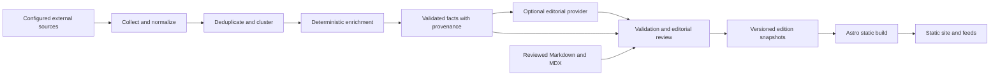

# The Security Diff — design and architecture

Date: 2026-09-26  
Status: proposed implementation baseline, written at the user's request; application implementation has not started.  
Product specification: [original spec](../../../the-security-diff-implementation-spec.md).  
Execution rules: [AGENTS.md](../../../AGENTS.md).

## 1. Intent and confirmed decisions

Build a daily security engineering newspaper at `tsd.report`. A reader should quickly understand what changed, which technology is affected, how strong the evidence is, and what action is supported by the sources.

Confirmed by the user: the attached Daily Diff screenshot is the visual reference; improve on its usefulness for security engineering; use `/article/[slug]`; document the design and agent rules before building.

The remaining concrete choices below are proposed defaults. They make the first build executable and can be refined after seeing the prototype. They do not represent approval to publish publicly, purchase services, or enable unattended editorial publication.

## 2. Design direction and alternatives

| Approach | Benefit | Tradeoff |
| --- | --- | --- |
| Editorial newspaper with integrated evidence — selected | Preserves the reference's identity and adds clear security context | Requires careful density and typography tuning |
| Magazine with large cards and imagery | More space for individual feature stories | Fewer useful stories visible and weaker daily-edition identity |
| Intelligence dashboard | Many metrics and comparisons visible | Gives metrics more prominence than reporting and original writing |

Improve the reference through clearer attribution, concise action summaries, accessible filters, mobile reading, explicit unknown states, and dated intelligence. Preserve the recognizable newspaper composition.

### Reference observations

The supplied screenshot shows a centered cream sheet against a slightly darker background; a small archive/date/story-count row; an oversized black serif masthead; an italic subtitle; a double rule; compact red/tan filter controls; a red top-story label; a wide headline; a roughly balanced illustration/text lead; and three ruled columns below. The page has generous outer margins but dense editorial content.

The screenshot is a composition reference, not a reusable asset. Its browser toolbar contains unrelated personal information; do not copy it into this repository or ship it. No third-party illustration or article text is licensed by the screenshot.

## 3. Page composition

```text
Centered paper sheet
  Archive · tsd.report       Previous / edition date / Next       Count · Theme
                            THE SECURITY DIFF
                    Security engineering, without the noise.
  ========================================================================
  Topic: All / Vulnerabilities / Supply Chain / AI / AppSec / Cloud / ...
  Signal: All / Recommended / Must Read                    Matching count
  ------------------------------------------------------------------------
  TOP STORY · category
  Headline spanning the edition width
  Original technical illustration   Summary
                                    Why it matters
                                    Affected technology · What to do
                                    Source attribution · Security signal
  ------------------------------------------------------------------------
  Secondary story                  Secondary story          Secondary story
  Secondary story                  Secondary story          Secondary story
  ------------------------------------------------------------------------
  Today's Vulnerability Watch — compact, dated, sourced table
  ------------------------------------------------------------------------
  From the Editor — original writing
  Research Worth Reading — selected research and commentary
  Edition navigation · RSS · JSON · Markdown · Editorial policy
```

The top row date is the edition date, not the device's current date. The masthead links home. Previous/next navigation traverses existing editions and cannot point to missing dates. Story totals are derived from unique edition entries.

Homepage order is editorially determined and stable. The full lead appears once; exclude it from the secondary grid. Original and research selections also appear once in the initial unfiltered edition. Do not duplicate stories merely to fill sections.

## 4. Tokens and typography

Use CSS custom properties in `src/styles/tokens.css`. The values below are starting tokens, subject to measured contrast and browser review.

| Token | Light | Dark |
| --- | --- | --- |
| `--canvas` | `#E7E2D3` | `#151412` |
| `--paper` | `#FAF6EA` | `#211F1B` |
| `--ink` | `#201E19` | `#F2ECDD` |
| `--muted` | `#625D50` | `#BCB3A2` |
| `--rule` | `#C8C0AE` | `#514B40` |
| `--accent` | `#962C1D` | `#F29A86` |
| `--surface` | `#F0E9D5` | `#2D2923` |
| `--focus` | `#285F86` | `#92C9EC` |

Selected controls use a separate filled-button background/text pair with checked contrast. Do not assume that the dark accent works as a background with white text. Severity colors are supplementary; always include a text label.

- Masthead/headlines: start with a locally hosted, licensed editorial serif, proposed `Source Serif 4`, with Georgia and serif fallbacks. Compare its bold masthead in-browser before finalizing.
- Body: the same serif family for cohesion; metadata/navigation: system sans; technical identifiers/code: system monospace. Limit font downloads to the styles actually used.
- Masthead: fluid 40–88 px; lead headline: 30–48 px; secondary headline: 22–28 px; body: 18–20 px; metadata: 12–14 px. Avoid small all-caps paragraphs.
- Body line height: 1.5–1.65; headline line height: 1.05–1.15. Long-form reading width: at most 70 characters.
- Spacing scale: 4, 8, 12, 16, 24, 32, 48, 64 px. Use rules and whitespace to organize content.
- Controls may use a 4 px radius; story containers have square corners. No elevated-card grid or ornamental shadows.
- Diagrams use the paper/surface/ink/accent palette and concise labels. Each diagram needs a meaningful text equivalent; decorative marks use empty alt text.
- Optional drop caps belong only in feature introductions and must not disrupt reading order or text selection.

## 5. Responsive behavior

| Viewport | Layout |
| --- | --- |
| 320–767 px | One column, 16 px sheet padding, wrapped top row, stacked lead, horizontally scrollable topic strip |
| 768–1099 px | Two story columns, 24 px padding; lead may split when both sides retain readable widths |
| 1100 px and wider | Three story columns, 40 px padding, split lead; sheet max-width 1440 px |

Use CSS grid and natural content height. Lead text must never be clipped to match illustration height. Remove vertical rules when columns stack. At 320 px, the masthead must fit through wrapping or responsive type sizing, never horizontal page scrolling.

The vulnerability table may scroll inside a labeled region. Keep the CVE identifier and action link easy to locate. Do not hide the meaning of columns at small widths. Topic-strip scrolling must be keyboard accessible and visibly discoverable.

## 6. Components and reader interactions

| Component | Responsibility |
| --- | --- |
| `EditionHeader` | Masthead, available-edition navigation, story count, theme toggle |
| `EditionFilters` | Topic/signal controls, URL state, result announcement, reset |
| `LeadStory` | Headline, original illustration, summary, impact, affected technology, action |
| `StorySummary` | Type/category, headline, short summary, compact source/signal metadata |
| `SignalLabel` | Label plus accessible explanation of deterministic reasons |
| `VulnerabilityWatch` | Unique CVEs, scores, evidence states, source date, detail links |
| `EvidenceList` | Sources, claim provenance, timestamps, conflict notes |
| `ArticleBody` | Structured briefs or trusted Markdown/MDX in the same reading layout |
| `EditionFooter` | Edition links, feeds, editorial/about links |

### Filters

- Topic values: `all`, `vulnerabilities`, `supply-chain`, `ai-security`, `appsec`, `cloud`, `research`, `security-engineering`.
- Signal values: `all`, `recommended`, `must-read`. Recommended includes both recommended and must-read stories; Must Read includes only must-read stories. Explain this in the control's accessible description.
- Combine topic and signal with AND. Persist as `?topic=...&signal=...`; Back/Forward restores selections. Ignore invalid values and fall back to All.
- In filtered mode, use one results list that includes matching stories from every edition section, including the lead. Keep the edition masthead and date. Restore the editorial composition when both filters return to All.
- Show the matching count, announce changes with a polite live region, and provide a clear reset action for zero results. Filtering must not move keyboard focus unexpectedly.
- With JavaScript disabled, render the complete edition and working category links. Do not display nonfunctional signal buttons. Reveal enhanced controls only when initialized.
- Filter URLs canonicalize to their edition route; category pages have their own canonical URLs.

### Theme and navigation

Use system preference until the reader chooses light or dark. Persist the explicit choice; tolerate unavailable local storage. Keep the toggle labeled and keyboard operable. Apply the theme before paint using a CSP-compatible approach. The site must remain readable when scripts fail.

Use semantic anchors for navigation and buttons for actions. Add a skip link, visible focus, accessible control names, and an adequate touch target, aiming for 44 × 44 CSS px. Respect reduced motion. Do not communicate meaning using color alone.

## 7. Routes and page responsibilities

| Route | Behavior |
| --- | --- |
| `/` | Latest published edition; fixture edition in clearly marked preview builds |
| `/today` | Static alias of the latest edition with canonical `/`; host redirect optional if supported |
| `/YYYY/MM/DD` | Immutable edition snapshot with previous/next available-edition links |
| `/archive` | Year/month/date listing with derived story counts |
| `/article/[slug]` | Every story type; unique stable slug; brief or long-form body |
| `/category/[category]` | All published coverage in a canonical taxonomy category |
| `/tag/[tag]` | Normalized tag index with readable label |
| `/cve/[cve]` | Latest validated intelligence, as-of timestamps, history of TSD coverage |
| `/authors/[slug]` | Real author bio and original writing, in the original-publishing milestone |
| `/rss.xml`, `/feed.json`, `/markdown` | Published content feeds; fixture previews labeled and blocked from production |
| `/about`, `/editorial-policy` | Publication identity, sources, automation/review policy, corrections |
| `/404` | Helpful missing-page state and links to archive/home |

Use uppercase CVE identifiers and lower-case kebab-case article/category/tag slugs. Canonical URLs use HTTPS, `tsd.report`, and no trailing slash except `/`. Reject slug collisions and invalid calendar dates at build time.

Article pages display type, dates, byline/review status, summary, impact, affected technology, action, evidence, and related coverage. Unknown fields are explicit where their absence affects decisions. Long-form articles add readable headings and code blocks; a table of contents is optional when useful.

CVE pages distinguish CVSS score/version/vector/source; EPSS probability/percentile/date; KEV membership/catalog time; known exploitation; and public PoC evidence. A missing KEV match is "No" only after a successful, sufficiently current catalog check. A stale check is labeled with its date and is not a current negative claim.

## 8. Content contract

Version every serialized edition with `schema_version`. JSON field names use snake_case to align with the original examples. Derive TypeScript types from runtime schemas rather than maintaining parallel handwritten definitions. Add a generated JSON Schema for the Python boundary before pipeline integration.

| Entity | Required contract |
| --- | --- |
| `Source` | Stable id, name, canonical URL, source type, published time when known, retrieved time |
| `Claim<T>` | Nullable value, source references, retrieved time, observed/effective date when known, conflict state |
| `Vulnerability` | CVE, optional GHSA aliases; separately sourced CVSS, EPSS, percentile, KEV, exploitation, PoC, package/version/fix data, CWE and advisory references |
| `SecuritySignal` | Deterministic score/label/reasons, rule version; optional attributed editorial override |
| `Story` | Stable id/slug, type, title, category, tags, dates, sources, editorial fields, affected data, vulnerability references, signal, fixture status, review status |
| `Edition` | Schema version, edition date/timezone, generated time, publication status, ordered story snapshots, lead id, section ids, derived statistics, fixture status |
| `OriginalArticle` | Frontmatter with title, description, date, slug, type, category, tags, real author id, optional series/featured fields; body in Markdown/MDX |

CVSS is 0–10; EPSS probability and percentile are 0–1. `0` is a valid value. Evidence states are true/false/null, with sources supporting true or false. Do not infer no exploitation from the absence of an advisory statement.

Source precedence is per field: FIRST for EPSS, CISA for KEV, vendor/CNA advisories for product fixes, ecosystem advisories for package ranges, and attributed CVSS assessments from their issuing sources. Preserve multiple differing CVSS assessments. NVD is an enrichment source and must not silently override vendor fixes. Source adapters retain the original structured ranges as well as any display text.

Use a distinct non-CVE identifier for synthetic scenarios. For `/cve/` prototype routes, check in a small dated set of real evidence snapshots, preserving attribution and labeling the entire experience as a fixture preview. Source dates must remain visible; historical scores are not current scores.

Prototype content: at least 15 stories spanning all seven categories and all eight types, three sample editions, one Markdown original article, and cases for missing scores, unknown fixes, conflicting evidence, long headlines, multiple CVEs, and no filter matches. Shared coverage is permitted across editions; duplicate ids inside one edition are not.

## 9. Static frontend and pipeline architecture



The frontend consumes validated edition/content data through one loader. Components never open arbitrary data files or fetch intelligence APIs. Limit browser JavaScript to filters, theme, and later search. No React or equivalent runtime is required for the initial prototype.

Persist `raw`, `normalized`, `deduplicated`, `enriched`, `editorial`, and `editions` stages separately. Source adapters fail independently and record results. Use bounded timeouts, retries with backoff, rate limits, response limits, and a declared source registry.

URL canonicalization must preserve semantically meaningful parameters. Clustering uses advisory identifiers, canonical URLs, and corroborating metadata. A shared CVE may relate multiple stories; it does not automatically prove two reports describe the same event. Keep merge explanations and editorial split/merge overrides.

Signal rules are deterministic and versioned. KEV or confirmed exploitation can yield Must Read; combined severity/EPSS rules follow the product spec. Signals express editorial priority, not a prediction of a reader's personal exposure. Homepage diversity never forces low-value filler.

The editorial provider accepts validated evidence and returns only headline, summary, impact, affected audience, action summary, category, and tags. `EDITORIAL_PROVIDER=none` must remain functional. Quarantine unsupported factual claims and malformed output. Store model-generated copy apart from source facts. Changing structured facts through editorial output must be impossible at the contract boundary.

## 10. Edition time, correction, and publication policy

- Proposed operational default: UTC timestamps and UTC edition boundaries; collection every four hours; daily candidate composition at 06:00 UTC. Scheduler delay does not change the intended edition date.
- Manual review is the initial publication mode. Automation creates candidates; an editor explicitly selects publication. Unattended publication requires a later explicit policy decision.
- Publication freezes the story and intelligence snapshot for that edition. A rebuild must not refetch facts or change its past meaning.
- The CVE index may display newer validated data with its own as-of timestamp; edition links retain historical context. Article corrections show an updated timestamp and correction note, while archived snapshots preserve the original edition.
- Write candidates to a temporary path, validate completely, then atomically promote the edition. Serialize runs per edition date and use stable ids for safe retries.
- A failed/empty run retains the last good edition. Partial source failure may still produce a reviewable candidate; record the coverage gaps and stale evidence. Do not claim freshness solely because the build succeeded.
- Keep published editions and original articles permanently. Proposed raw retention is 90 days; enable any deletion only after archival/recovery has been verified. Do not commit large raw histories indefinitely.

## 11. Accessibility, performance, and security targets

- Target WCAG 2.2 AA; validate text/control contrast, landmarks, headings, keyboard access, focus, zoom, reduced motion, and accessible table structure. Automated checks alone cannot establish conformance.
- Review at 320, 390, 768, 1024, and 1440 px, light and dark, plus 200% zoom and reflow at an effective 320 px. No page overflow except intentional table/code/strip regions.
- Prototype budgets: at most 50 KB gzip first-party homepage JavaScript, 250 KB total initially loaded fonts, and 250 KB per optimized lead illustration. Reserve image dimensions to avoid layout shift.
- Performance target: median mobile Lighthouse performance at least 90 over three comparable local production-build runs; record tool version/settings. Post-launch field targets are LCP ≤2.5 s, INP ≤200 ms, CLS ≤0.1 at the 75th percentile when enough data exists.
- Pin CI actions to full commit hashes, use least-privilege job permissions, lock dependencies, and run dependency/secret scanning and supported code analysis. Check what CI products support the selected languages before making them required gates.
- Sanitize untrusted content, constrain collector destinations and redirects, and enforce a CSP compatible with local fonts, local assets, and theme initialization. Keep MDX restricted to reviewed repository authors.
- Public launch adds HTTPS, validated canonical host redirects, security headers, a working `security.txt` with a confirmed contact, and rollback documentation. Confirm hosting capabilities before encoding platform-specific settings.

## 12. Review rubric and open operational decisions

The first prototype passes design review only if the masthead dominates without excessive empty space; the split lead and three-column grid preserve the screenshot's rhythm; sources and actions are easy to find; narrow screens feel intentionally designed; and dark mode retains an editorial identity. Inspect screenshots and interact with the pages; do not substitute a build result for review.

Decisions deferred until their milestone: hosting provider/account and DNS access; confirmed author biography and public security contact; licensed font final selection; editorial AI provider and cost ceiling; unattended publishing policy. None blocks the local fixture prototype. Do not fabricate identities, contacts, or credentials to fill these gaps.

Changes to this baseline should include the reason, affected milestone, and required validation. Keep `/article/[slug]`, source integrity, archival semantics, and the newspaper identity consistent across subsequent work.
