# The Security Diff — Product & Implementation Specification

**Domain:** `tsd.report`  
**Product name:** **The Security Diff**  
**Abbreviation:** **TSD**  
**Primary inspiration:** The Daily Diff (`tdd.cat`)  
**Positioning:** A newspaper-style security engineering publication combining curated security news, vulnerability intelligence, original technical writing, and actionable security context.

**Implementation guidance:** See the [design and architecture](docs/superpowers/specs/2026-09-26-tsd-design.md), [delivery plan](docs/superpowers/plans/2026-09-26-tsd-delivery.md), and [agent rules](AGENTS.md). The confirmed canonical article route is `/article/[slug]`.

---

## 1. Executive Summary

**The Security Diff** should not be another generic cybersecurity news aggregator.

The core idea is:

> **Take the daily security firehose and turn it into an engineer-friendly newspaper that explains what changed, who is affected, why it matters, and what action to take.**

The product should combine:

- curated security news,
- CVE intelligence,
- CVSS,
- EPSS,
- CISA KEV,
- affected technologies,
- fixed versions,
- exploitation context,
- software supply-chain incidents,
- AI/agent security,
- cloud and Kubernetes security,
- AppSec,
- security research,
- original technical writing,
- commentary on important research from others,
- compact actionable summaries.

The differentiator is not "more links."

The differentiator is:

> **News + CVE + EPSS + KEV + affected technology + practical security context + original engineering commentary.**

The visual experience should feel like a modern technical newspaper inspired by *The Daily Diff*: serif typography, paper-like background, compact story density, prominent lead story, daily editions, sections, archive, filters, and a strong editorial identity.

---

# 2. Brand

## 2.1 Name

# The Security Diff

The name works because "diff" naturally means:

- what changed,
- what is new,
- what changed in the threat landscape,
- what changed in software/security posture,
- what security engineers should notice today.

This makes it a natural security equivalent of *The Daily Diff*.

## 2.2 Domain

# `tsd.report`

The short domain works well with the full brand:

> **The Security Diff**  
> `tsd.report`

Example routes:

```text
tsd.report/
tsd.report/2026/09/26
tsd.report/cve/CVE-2026-12345
tsd.report/category/supply-chain
tsd.report/category/ai-security
tsd.report/article/how-to-monitor-ai-agents
```

## 2.3 Suggested tagline

Primary:

> **Security engineering, without the noise.**

Alternatives:

> What changed in security today.

> Security signal, minus the noise.

> Security intelligence for engineers.

> The daily diff for security engineering.

---

# 3. Product Principles

The implementation should follow these principles.

## 3.1 Security engineers first

The target reader is not a generic news reader.

The target audience includes:

- Application Security engineers,
- Product Security engineers,
- Cloud Security engineers,
- DevSecOps engineers,
- Security Engineering teams,
- vulnerability management teams,
- software supply-chain engineers,
- security researchers,
- engineering leaders who need security context,
- developers who want practical security signal.

## 3.2 Actionable over sensational

Every important story should attempt to answer:

```text
What happened?
↓
What technology is affected?
↓
What is the vulnerability / security issue?
↓
Is exploitation known?
↓
Is it in CISA KEV?
↓
What is the EPSS probability?
↓
What versions are vulnerable?
↓
Is there a fixed version?
↓
Who should care?
↓
What should they do?
```

## 3.3 Evidence before prose

Structured security facts must come from authoritative sources.

The LLM may help with:

- summarization,
- classification,
- rewriting,
- headline generation,
- "why this matters",
- readable explanation.

The LLM must **not invent**:

- CVE IDs,
- CVSS values,
- EPSS values,
- KEV status,
- affected versions,
- fixed versions,
- vendor mitigations,
- exploitation status,
- advisory URLs.

## 3.4 Static-first architecture

V1 should be:

- inexpensive,
- fast,
- cacheable,
- low maintenance,
- easy to deploy,
- resilient.

Avoid introducing a database until it is actually needed.

The site should be generated primarily from:

```text
JSON
+
Markdown / MDX
+
Astro static generation
```

---

# 4. Product Scope

The product should support five major content families.

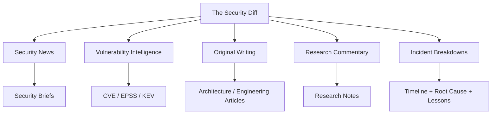

---

# 5. Content Types

Every piece of content should have an explicit type.

Recommended types:

```text
news
cve
research
original
incident
explainer
tool
advisory
```

## 5.1 News

Short daily security stories.

Example:

> New Kubernetes vulnerability affects admission controller deployments.

## 5.2 CVE

A vulnerability-focused entry with structured enrichment.

Example:

> CVE-2026-XXXXX added to CISA KEV.

## 5.3 Research

A summary or commentary around a security paper, researcher blog, or technical write-up.

## 5.4 Original

Your own long-form security engineering writing.

## 5.5 Incident

A detailed breakdown of:

- supply-chain attack,
- package compromise,
- token leak,
- cloud compromise,
- CI/CD security incident,
- major security outage.

## 5.6 Explainer

Educational pieces such as:

- EPSS vs CVSS vs KEV,
- TLS / mTLS,
- supply-chain provenance,
- admission controllers,
- AI agent threat models.

## 5.7 Tool

Interesting open-source security tools, releases, scanners, or useful engineering projects.

## 5.8 Advisory

Direct vendor / CERT / government security advisories.

---

# 6. Main Editorial Categories

Start with a limited taxonomy.

```text
VULNERABILITIES
SUPPLY CHAIN
AI & AGENT SECURITY
APPSEC
CLOUD & KUBERNETES
RESEARCH
SECURITY ENGINEERING
```

## 6.1 Tags

Use tags for finer classification.

Examples:

```text
#kubernetes
#aws
#gcp
#azure
#npm
#pypi
#github-actions
#slsa
#sbom
#provenance
#mcp
#agents
#llm
#secrets
#sast
#dast
#sca
#runtime
#iam
#oauth
#tls
#container
#linux
#supply-chain
#cve
#kev
#epss
```

---

# 7. Homepage Information Architecture

The homepage should feel like a newspaper rather than a dashboard.

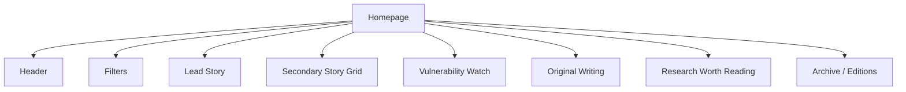

A proposed layout:

```text
┌─────────────────────────────────────────────────────────────┐
│ ARCHIVE              SATURDAY, SEP 26, 2026       31 STORIES│
│                                                             │
│                    THE SECURITY DIFF                        │
│                                                             │
│                Security engineering,                        │
│                 without the noise.                          │
│                                                             │
│                        tsd.report                            │
├─────────────────────────────────────────────────────────────┤
│ TOPIC                                                       │
│ ALL  VULNS  SUPPLY CHAIN  AI  APPSEC  CLOUD  RESEARCH      │
│                                                             │
│ SIGNAL                                                      │
│ ALL             RECOMMENDED             MUST READ           │
├─────────────────────────────────────────────────────────────┤
│ ● TOP STORY                                                 │
│                                                             │
│ Headline                                                    │
│                                                             │
│ [Illustration]          Summary                             │
│                         Why it matters                      │
│                         Who is affected                     │
│                         What to do                          │
├─────────────────────────────────────────────────────────────┤
│ Story 1              Story 2               Story 3          │
│                                                             │
│ Story 4              Story 5               Story 6          │
├─────────────────────────────────────────────────────────────┤
│ TODAY'S VULNERABILITY WATCH                                 │
│                                                             │
│ CVE        CVSS       EPSS       KEV       TECHNOLOGY       │
├─────────────────────────────────────────────────────────────┤
│ FROM THE EDITOR                                             │
│ Original article                                            │
├─────────────────────────────────────────────────────────────┤
│ RESEARCH WORTH READING                                      │
└─────────────────────────────────────────────────────────────┘
```

---

# 8. Visual Design System

## 8.1 General style

The design should be inspired by traditional newspapers.

Avoid generic cybersecurity aesthetics such as:

- neon green,
- matrix backgrounds,
- shields everywhere,
- glowing hacker silhouettes,
- excessive dashboard widgets.

Prefer:

- warm paper background,
- readable serif typography,
- thin black or charcoal rules,
- dark red accent,
- subtle grayscale diagrams,
- compact metadata,
- editorial hierarchy.

## 8.2 Typography

Suggested hierarchy:

```text
Masthead      Large serif display font
Headlines     Serif
Body          Serif
Metadata      Small sans / small caps
Navigation    Sans / condensed
Code          Monospace
```

## 8.3 Color direction

Suggested semantic palette:

```text
Paper             warm cream
Primary text      near-black
Secondary text    muted charcoal
Accent            dark brick red
Borders           gray / tan
Critical          restrained dark red
Warning           muted amber
Positive          muted green
```

The site should also support dark mode.

---

# 9. Frontend Technology

Recommended stack:

| Layer | Technology |
|---|---|
| Framework | Astro |
| Language | TypeScript |
| Styling | SCSS or plain CSS |
| Content | JSON + Markdown / MDX |
| Charts | optional Chart.js / lightweight SVG |
| Search | Pagefind or MiniSearch initially |
| Hosting | Cloudflare Pages or Vercel |
| CDN | provided by host |
| Analytics | privacy-friendly analytics if needed |

Astro is a strong fit because:

- the product is mostly content,
- daily editions are ideal for static generation,
- routes can be generated at build time,
- Markdown/MDX is first-class,
- JavaScript can remain minimal.

---

# 10. Backend / Data Pipeline Technology

Recommended:

| Component | Technology |
|---|---|
| Data pipeline | Python |
| Validation | Pydantic |
| HTTP | httpx |
| RSS | feedparser |
| Scheduling | GitHub Actions |
| LLM integration | provider abstraction |
| Storage V1 | version-controlled JSON |
| Database | none initially |

---

# 11. Overall Architecture

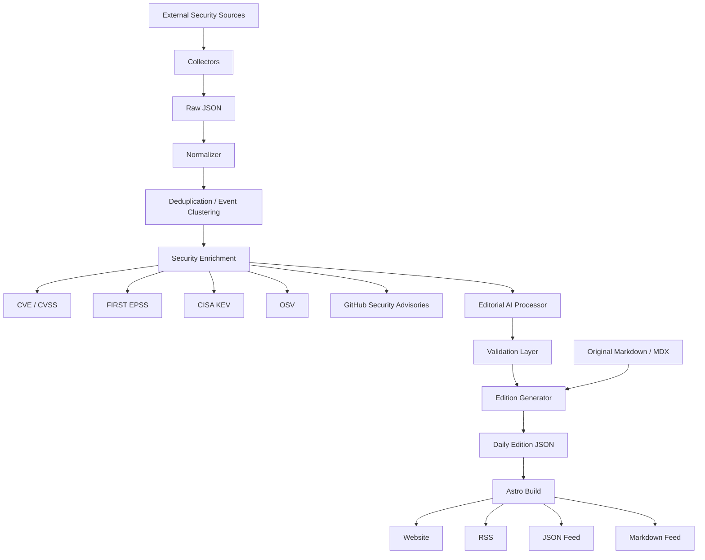

---

# 12. Data Processing Stages

Persist every major pipeline stage.

```text
raw
↓
normalized
↓
deduplicated
↓
enriched
↓
editorial
↓
published
```

Recommended folder structure:

```text
data/
  raw/
  normalized/
  deduplicated/
  enriched/
  editorial/
  editions/
```

This makes debugging easy.

---

# 13. Repository Structure

```text
the-security-diff/
│
├── .github/
│   └── workflows/
│       ├── ingest.yml
│       ├── validate.yml
│       ├── publish-daily.yml
│       └── deploy.yml
│
├── pipeline/
│   ├── collectors/
│   │   ├── cisa_kev.py
│   │   ├── epss.py
│   │   ├── github_advisories.py
│   │   ├── osv.py
│   │   ├── nvd.py
│   │   ├── rss.py
│   │   ├── hackernews.py
│   │   └── arxiv.py
│   │
│   ├── enrichment/
│   │   ├── cve.py
│   │   ├── epss.py
│   │   ├── kev.py
│   │   ├── packages.py
│   │   ├── exploit_status.py
│   │   └── technology.py
│   │
│   ├── processing/
│   │   ├── normalize.py
│   │   ├── deduplicate.py
│   │   ├── cluster.py
│   │   ├── classify.py
│   │   ├── rank.py
│   │   └── summarize.py
│   │
│   ├── validators/
│   │   ├── facts.py
│   │   ├── sources.py
│   │   └── schema.py
│   │
│   ├── models/
│   │   ├── source.py
│   │   ├── story.py
│   │   ├── advisory.py
│   │   ├── vulnerability.py
│   │   └── edition.py
│   │
│   └── main.py
│
├── config/
│   ├── sources.yml
│   ├── taxonomy.yml
│   ├── ranking.yml
│   └── editorial.yml
│
├── data/
│   ├── raw/
│   ├── normalized/
│   ├── deduplicated/
│   ├── enriched/
│   ├── editorial/
│   └── editions/
│
├── content/
│   ├── articles/
│   ├── research/
│   ├── explainers/
│   └── incidents/
│
├── src/
│   ├── components/
│   ├── layouts/
│   ├── pages/
│   ├── styles/
│   ├── lib/
│   └── assets/
│
├── public/
│   ├── icons/
│   └── images/
│
├── tests/
│
├── astro.config.mjs
├── package.json
├── pyproject.toml
└── README.md
```

---

# 14. Security Sources

Use a mix of authoritative structured sources and editorial sources.

## 14.1 Vulnerability intelligence

Primary:

- CISA Known Exploited Vulnerabilities
- NVD
- FIRST EPSS
- GitHub Security Advisories
- OSV
- vendor advisories
- CERT advisories

## 14.2 Cloud security

Potential sources:

- AWS Security Blog
- Google Cloud Security
- Microsoft Security
- Kubernetes security announcements
- cloud provider advisories

## 14.3 Supply-chain security

Potential sources:

- GitHub Security Advisories
- OSV
- OpenSSF
- package ecosystem advisories
- npm ecosystem research
- PyPI ecosystem research
- SLSA / Sigstore updates
- GitHub Actions security research

## 14.4 AppSec and research

Potential sources:

- PortSwigger Research
- Google Project Zero
- Trail of Bits
- academic papers
- arXiv security papers
- well-known independent researchers
- selected company research blogs

## 14.5 AI / agent security

Potential sources:

- AI security research
- MCP security research
- agent security blog posts
- tool-use / prompt injection research
- open-source AI security projects
- vendor advisories related to AI developer tooling

## 14.6 Community sources

Community sources are useful for discovery and discussion.

Examples:

- Hacker News
- GitHub trending/security projects
- selected technical Reddit communities

Community sources should usually not be treated as authoritative for:

- fixed versions,
- severity,
- KEV status,
- exploitation confirmation,
- vendor remediation.

---

# 15. Collector Architecture

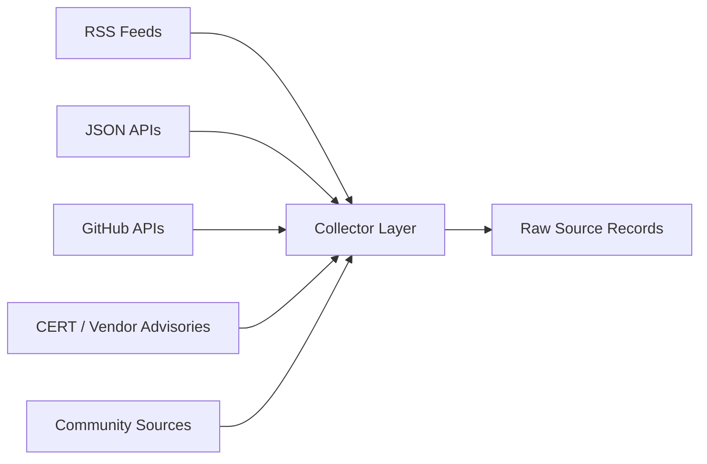

Each collector should:

1. fetch source,
2. retain the original URL,
3. normalize timestamps,
4. store raw metadata,
5. avoid destructive transformation,
6. store retrieval time,
7. fail independently.

A broken RSS source should never break the entire daily build.

---

# 16. Raw Source Record

Example:

```json
{
  "source_id": "aws-security-blog",
  "source_type": "rss",
  "title": "Example advisory",
  "url": "https://example.com/post",
  "author": "Vendor",
  "published_at": "2026-09-26T09:15:00Z",
  "retrieved_at": "2026-09-26T09:20:00Z",
  "summary": "Original feed summary",
  "raw_tags": ["security"]
}
```

---

# 17. Normalization

The normalizer should standardize:

- title,
- URL,
- canonical URL,
- author,
- published time,
- source type,
- source trust category,
- detected CVEs,
- detected GHSAs,
- package names,
- ecosystem,
- initial category.

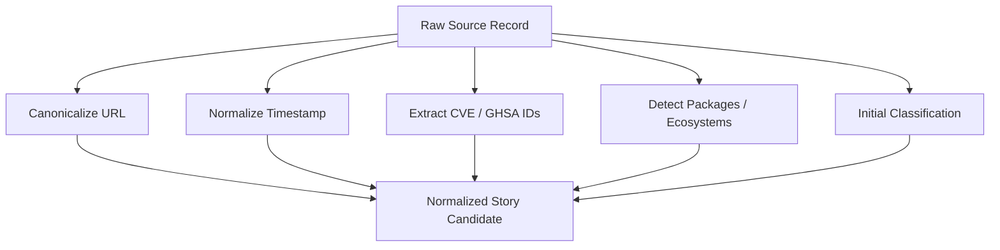

---

# 18. Deduplication and Event Clustering

Security stories are heavily duplicated.

One incident may appear in:

```text
Vendor advisory
CISA
NVD
GitHub
BleepingComputer
Hacker News
Research blog
Company blog
```

These should ideally become one security event.

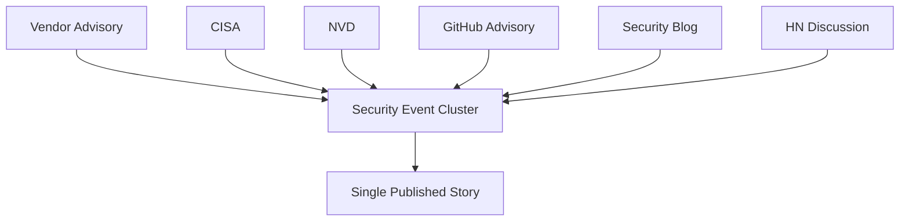

Dedup signals:

```text
exact CVE match
GHSA match
canonical URL
same package
same project/vendor
normalized title similarity
publication time proximity
matching advisory identifier
```

Do not require embeddings in V1.

---

# 19. Vulnerability Enrichment

Any candidate containing CVEs should be enriched.

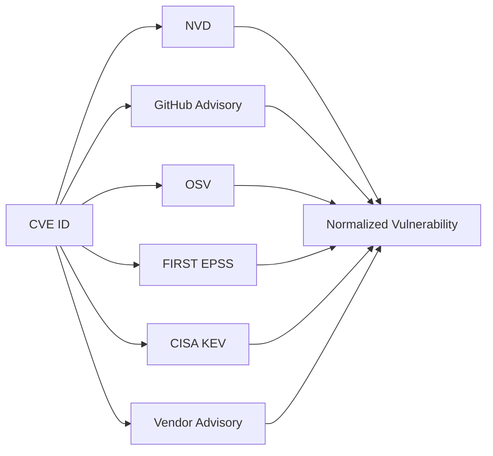

Store:

```text
CVE
GHSA
CVSS
severity
EPSS
EPSS percentile
CISA KEV status
known exploitation
public PoC status if reliably known
affected technology
affected versions
fixed versions
package ecosystem
vendor
CWE
published date
modified date
references
```

---

# 20. Important Security Semantics

Do not conflate:

```text
Public PoC
Known exploitation
CISA KEV
High EPSS
High CVSS
```

These represent different things.

Example UI:

```text
Public PoC          YES
Known exploitation  UNKNOWN
CISA KEV            NO
EPSS                 73%
CVSS                 9.1
```

This distinction is important and educational.

---

# 21. Canonical Story Schema

Example:

```json
{
  "id": "story_20260926_001",
  "type": "news",
  "title": "Example vulnerability affects Example Server",
  "slug": "example-server-vulnerability",

  "published_at": "2026-09-26T08:10:00Z",
  "collected_at": "2026-09-26T08:20:00Z",

  "category": "vulnerabilities",

  "tags": [
    "rce",
    "server",
    "open-source"
  ],

  "source": {
    "name": "Vendor Security Advisory",
    "url": "https://example.com/advisory",
    "type": "vendor"
  },

  "references": [],

  "summary": "Concise summary.",

  "why_it_matters": "Why this matters to security engineers.",

  "affected": {
    "technologies": [],
    "packages": [],
    "versions": []
  },

  "vulnerabilities": [
    {
      "cve": "CVE-2026-XXXXX",
      "ghsa": null,
      "cvss": 9.1,
      "severity": "critical",
      "epss": 0.76,
      "epss_percentile": 0.97,
      "kev": true,
      "fixed_versions": []
    }
  ],

  "action": {
    "text": "Upgrade to a fixed version.",
    "source": "vendor"
  },

  "signal": {
    "score": 91,
    "label": "must-read",
    "reasons": [
      "CISA KEV",
      "high EPSS",
      "critical severity"
    ]
  },

  "editorial": {
    "generated": true,
    "reviewed": false
  }
}
```

---

# 22. Provenance

Every important security fact should track provenance.

Example:

```json
{
  "epss": {
    "value": 0.8182,
    "percentile": 0.9811,
    "source": "FIRST",
    "retrieved_at": "2026-09-26T08:00:00Z"
  }
}
```

Recommended claim model:

```json
{
  "claim": "Version 3.2.4 fixes this vulnerability.",
  "source_url": "https://vendor.example/advisory",
  "source_type": "vendor",
  "retrieved_at": "2026-09-26T08:00:00Z",
  "confidence": "authoritative"
}
```

Potential UI:

```text
WHY ARE WE SAYING THIS?

Fixed version 3.2.4
↳ Vendor advisory

EPSS 81%
↳ FIRST

Known exploited
↳ CISA KEV
```

---

# 23. AI Editorial Layer

The AI layer should operate only after deterministic enrichment.

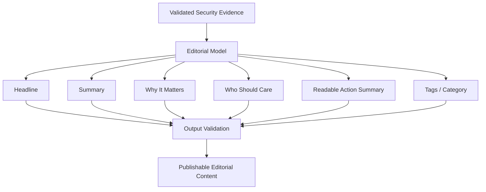

Prompt requirements:

```text
Use only the supplied evidence.

Do not invent:
- CVE identifiers
- CVSS scores
- EPSS values
- KEV membership
- fixed versions
- affected versions
- vendor mitigation
- exploitation confirmation

If evidence is insufficient, return null.
```

Use structured output.

Example:

```json
{
  "headline": "",
  "summary": "",
  "why_it_matters": "",
  "affected_audience": "",
  "actionable_summary": "",
  "category": "",
  "tags": []
}
```

---

# 24. Security Signal

The homepage can expose a **Security Signal**.

Do not make it a mysterious score.

The score should be explainable.

Potential components:

```text
Exploitation evidence
KEV membership
EPSS
CVSS / severity
Recency
Technology prevalence
Source confidence
Editorial relevance
```

Example internal model:

```json
{
  "severity": 90,
  "exploitability": 95,
  "exploitation": 100,
  "recency": 94,
  "editorial_relevance": 80
}
```

Displayed as:

```text
MUST READ

Why?

✓ CISA KEV
✓ EPSS 96th percentile
✓ Critical severity
✓ Public-facing server software
```

---

# 25. Signal Labels

Homepage filter:

```text
ALL
RECOMMENDED
MUST READ
```

Prefer deterministic rules.

Example:

```yaml
must_read:
  any:
    - kev: true
    - confirmed_exploitation: true

  combinations:
    - cvss_gte: 9.0
      epss_percentile_gte: 0.90

recommended:
  any:
    - epss_percentile_gte: 0.80
    - cvss_gte: 8.0
    - vendor_priority: high
```

AI should not arbitrarily assign MUST READ.

---

# 26. Homepage Diversity

Do not allow one category to dominate the homepage just because it generates more raw events.

Use:

```text
Security Priority
↓
Editorial Composition
```

Potential homepage composition:

```text
1 lead story

4 vulnerability stories
3 supply-chain stories
3 AI / agent security stories
3 cloud / Kubernetes stories
2 AppSec stories
2 research stories
2 original / commentary stories
```

Only use content when worthwhile.

Do not fill category quotas with low-value stories.

---

# 27. Lead Story

The lead story should contain:

```text
type
source
headline
illustration
summary
why it matters
affected technology
recommended action
signal
references
```

Suggested component:

```text
TOP STORY · SUPPLY CHAIN

Headline

[diagram]

Summary...

WHY IT MATTERS
...

AFFECTED
npm · CI/CD · GitHub Actions

WHAT TO DO
...

Sources
Vendor · CISA · GitHub
```

---

# 28. Vulnerability Watch

Add a compact high-signal block.

Example:

```text
TODAY'S VULNERABILITY WATCH
──────────────────────────────────────────────────

14 new CVEs      3 critical      2 KEV      7 fixes

CVE              CVSS      EPSS       KEV      TECH
CVE-2026-...     9.8       96%        ●        nginx
CVE-2026-...     8.7       89%                 npm
CVE-2026-...     9.1       94%        ●        Linux
```

---

# 29. CVE Pages

Route:

```text
/cve/CVE-2026-12345
```

Example:

```text
CVE-2026-12345

CRITICAL

CVSS       9.8
EPSS       94%
Percentile 99.2%
KEV        YES

Published
Modified

Affected
────────────────
package / product
versions

Fixed
────────────────
version

Exploitation
────────────────
Known exploitation: yes/no/unknown
Public PoC: yes/no/unknown

References
────────────────
Vendor
NVD
GitHub
OSV
CISA

Coverage
────────────────
3 Security Diff stories mention this CVE
```

---

# 30. CVE History

Future feature:

```text
CVE-2026-XXXX

SEP 20
Published
EPSS 2%

SEP 21
Public research released
EPSS 21%

SEP 23
EPSS 73%

SEP 24
Added to CISA KEV

SEP 24
The Security Diff → MUST READ
```

This could become one of the strongest long-term intelligence features.

---

# 31. Supply-Chain Intelligence

Normalize packages using PURL where possible.

Examples:

```text
pkg:npm/express@5.1.0
pkg:pypi/requests@2.32.0
pkg:golang/github.com/example/foo@v1.2.3
```

Future package pages:

```text
/package/npm/express
```

Potential content:

```text
Current vulnerabilities
Historical vulnerabilities
Recent advisories
Security stories
Supply-chain incidents
Fixed versions
```

Do not build package pages in V1, but design the schema to support them later.

---

# 32. Search

The search experience should support:

```text
CVE
GHSA
package
technology
vendor
headline
author
category
tag
article text
```

Keyboard shortcut:

```text
⌘ K
```

Example:

```text
> kubernetes

CVE-2026-...
Kubernetes admission...
Runtime security...
```

Example:

```text
> CVE-2026-12345
```

Jump directly to the vulnerability.

---

# 33. URL Structure

Recommended routes:

```text
/
/today
/archive

/2026/09/26

/category/vulnerabilities
/category/supply-chain
/category/ai-security
/category/appsec
/category/cloud
/category/research
/category/security-engineering

/tag/kubernetes
/tag/mcp
/tag/npm

/cve/CVE-2026-12345

/article/how-to-monitor-ai-agents

/authors/pankaj

/rss.xml
/feed.json
/markdown
```

---

# 34. Daily Edition Schema

Example:

```json
{
  "date": "2026-09-26",

  "stats": {
    "stories": 28,
    "cves": 14,
    "critical": 3,
    "kev": 2
  },

  "lead_story": "story_x",

  "must_read": [],
  "recommended": [],

  "sections": {
    "vulnerabilities": [],
    "supply_chain": [],
    "ai_security": [],
    "cloud": [],
    "appsec": [],
    "research": []
  },

  "stories": []
}
```

Edition path:

```text
data/editions/2026/09/26.json
```

---

# 35. Daily Edition Flow

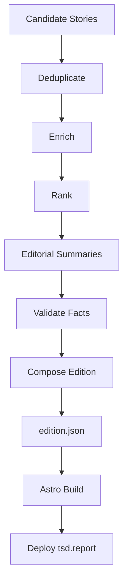

---

# 36. Scheduling

## 36.1 Collection workflow

Run every 2–4 hours.

```text
fetch
↓
normalize
↓
extract identifiers
↓
deduplicate
↓
enrich
↓
persist candidates
```

## 36.2 Edition workflow

Run once daily.

```text
candidate stories
↓
rank
↓
select
↓
summarize
↓
validate
↓
compose
↓
build
↓
deploy
```

---

# 37. GitHub Actions

Suggested workflows:

## ingest.yml

Runs:

```text
schedule
manual dispatch
```

Tasks:

```text
install Python
run collectors
normalize
deduplicate
enrich
validate
persist artifacts
```

## publish-daily.yml

Tasks:

```text
load enriched stories
generate editorial summaries
validate
build edition
commit edition JSON
build Astro
deploy
```

## validate.yml

Triggered on PR.

Tasks:

```text
Python unit tests
schema validation
TypeScript checks
Astro build
content checks
link validation
```

---

# 38. Original Writing

Original content should be first-class, not an afterthought.

Markdown example:

```yaml
---
title: "How I Would Monitor an AI Coding Agent"
description: "A practical architecture for observing agent activity."
date: 2026-09-26

type: original
category: ai-security

tags:
  - agents
  - mcp
  - devsecops

featured: true
author: pankaj
---
```

---

# 39. Strong Original Content Areas

Based on the security topics already explored, there is enough material for months of original writing.

## 39.1 AI / Agent Security

Potential series:

```text
How do you monitor an AI coding agent?

What actually happens when Cursor / Codex executes commands?

Designing telemetry for coding agents

Monitoring MCP client → server traffic

Prompt injection vs tool injection

Why AI agent security cannot rely only on the LLM

Least privilege for AI agents

Detecting secret exposure from coding agents

Monitoring package installation by AI agents

What should an AI-agent audit log contain?

Threat modeling MCP servers

Confused-deputy problems in MCP

Collector vs enforcement architecture for AI agent security

Why deterministic security controls still matter in agentic systems
```

---

# 40. Telescope / Agent Monitoring Series

Potential long-form series:

```text
Part 1 — What should we observe?
Part 2 — Collector architecture
Part 3 — Shell command telemetry
Part 4 — Package installation security
Part 5 — Secret detection
Part 6 — MCP traffic
Part 7 — Out-of-band analysis
Part 8 — Policy engines
Part 9 — Building detections
Part 10 — Designing enforcement safely
```

Reference architecture:

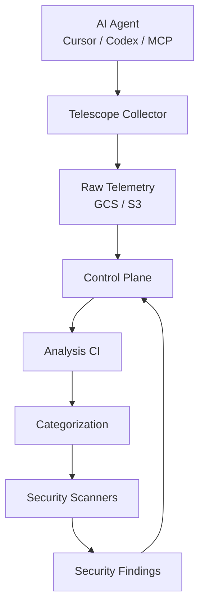

Potential scanners:

```text
TruffleHog
OSV
Safe.dev Vet
custom detections
future OPA / CEL policies
```

---

# 41. Supply-Chain Writing Ideas

Potential articles:

```text
Why SCA alone is not supply-chain security

SBOM vs SCA vs provenance

Container signing in CI

How vulnerability database outages break CI

Mirroring vulnerability databases safely

Security implications of package-manager compromise

What happens when a GitHub token leaks from CI?

Building safe GitHub Actions defaults

Securing reusable GitHub Actions

Pre-commit vs pre-push vs CI secret scanning

Scaling supply-chain controls across 100+ repositories

What does WONT_FIX really mean?

How to design vulnerability suppression safely

How provenance helps incident response

Why package installation by AI agents changes the supply-chain threat model
```

---

# 42. Vulnerability Management Writing Ideas

```text
CVSS is not vulnerability prioritization

EPSS explained for security engineers

What CISA KEV actually tells you

CVSS + EPSS + KEV: how they complement each other

Why "critical CVE count" is a bad KPI

Designing a vulnerability posture dashboard

Latest SemVer vs image digest for vulnerability posture

How vulnerability SLAs should work

What "fix deferred" means

What "won't fix" means

Reachability vs exploitability vs severity

Building useful vulnerability burndown metrics

How to prioritize vulnerabilities without creating noise
```

---

# 43. Cloud / Kubernetes / AppSec Writing Ideas

```text
How GuardDuty processes security signals

AWS ↔ GCP security-service mapping

Using Cloud Armor as a compensating control

TLS and mTLS visually explained

Where the private key is actually used in TLS

TLS termination explained

Broken access control in real systems

Kubernetes admission control as a security primitive

Runtime security vs build-time security

Threat modeling Kubernetes workloads

Kubernetes RBAC mistakes that matter

Why network policies are not enough

Cloud logging architecture for security teams
```

---

# 44. Research Commentary

Create a content format for reviewing other people's work.

Example:

```text
RESEARCH NOTE

Original:
"Example Security Research"
by Example Researcher

WHAT THEY FOUND
...

MY TAKE
...

WHY SECURITY ENGINEERS SHOULD CARE
...

ARCHITECTURE IMPLICATION
...

Original research →
```

Always separate:

```text
What the researcher demonstrated
vs
Your interpretation
```

---

# 45. Incident Breakdowns

Incident content should be more structured than normal news.

Recommended structure:

```text
Incident summary
Timeline
Attack path
Initial access
Affected technology
Credentials / tokens involved
Persistence
Impact
Detection opportunities
Response
Lessons for security teams
References
```

Potential diagram:

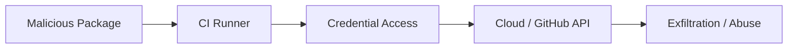

---

# 46. Story Page Layout

Recommended:

```text
SECURITY BRIEF · SUPPLY CHAIN

Headline

September 26, 2026 · 5 min

SUMMARY
...

WHY IT MATTERS
...

WHO IS AFFECTED
...

SECURITY SIGNAL
Critical · KEV · EPSS 91%

AFFECTED TECHNOLOGY
npm · GitHub Actions · CI/CD

WHAT YOU SHOULD DO
...

VULNERABILITIES
CVE-...
CVSS
EPSS
KEV

TIMELINE
...

REFERENCES
Vendor
CISA
GitHub
Research
```

---

# 47. Editorial Transparency

Every story should make authorship clear.

Suggested labels:

```text
ORIGINAL
SECURITY BRIEF
RESEARCH NOTE
INCIDENT
CVE
EXPLAINER
TOOL
ADVISORY
```

Potential metadata:

```text
Generated summary
Reviewed by editor
Last updated
Sources
```

---

# 48. Copyright and Content Policy

The publication should summarize, not republish.

Do not:

- copy full articles,
- mirror paywalled content,
- reproduce large excerpts,
- rehost third-party images without permission,
- copy another publication's proprietary illustrations,
- clone another site's code unless its license explicitly permits it.

Do:

- link to the original source,
- quote only very small excerpts where appropriate,
- provide attribution,
- generate original summaries,
- generate original diagrams,
- write independent commentary.

The Daily Diff should be treated as a **design and product inspiration** unless the repository license explicitly permits broader reuse.

---

# 49. Illustrations

Important stories should have technical illustrations.

Good illustration types:

```text
attack path
data flow
architecture
timeline
dependency graph
agent tool chain
TLS handshake
supply-chain compromise
cloud auth flow
Kubernetes architecture
```

Avoid generic hacker stock images.

## 49.1 Visual style

Use:

```text
paper background
thin lines
monochrome / muted red
hand-drawn technical look
minimal labels
newspaper illustration aesthetic
```

---

# 50. Diagram Generation

Prefer one of:

```text
Mermaid
SVG templates
Graphviz
D2
custom lightweight diagram renderer
```

Mermaid is ideal for authoring and automation.

If static image rendering is desired:

```text
Mermaid
↓
SVG
↓
optimized asset
↓
Astro
```

---

# 51. Search Architecture

V1:

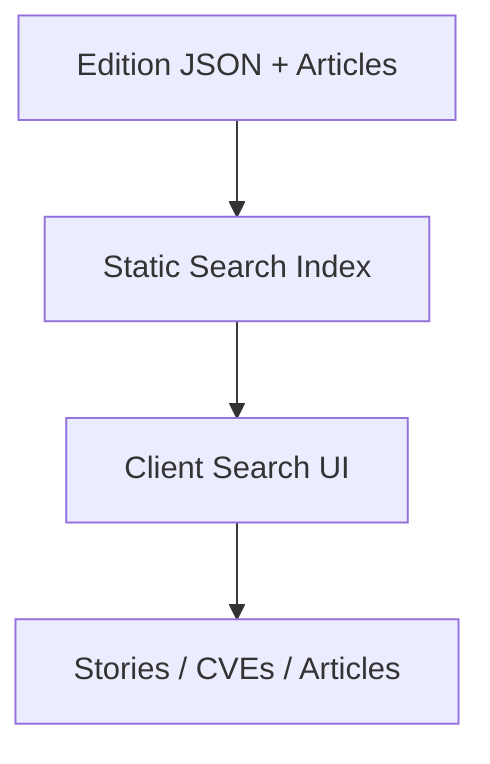

Potential engines:

- Pagefind
- MiniSearch
- Fuse.js

Pagefind is attractive for a static site.

---

# 52. Archive

The archive should be a first-class experience.

Potential layout:

```text
2026

September

26 — 31 stories
25 — 24 stories
24 — 27 stories
23 — 29 stories
```

Daily route:

```text
/2026/09/26
```

This preserves the newspaper-edition concept.

---

# 53. RSS / Feeds

Provide:

```text
/rss.xml
/feed.json
/markdown
```

Potential future feeds:

```text
/rss/vulnerabilities.xml
/rss/supply-chain.xml
/rss/ai-security.xml
```

---

# 54. SEO / Discoverability

Important pages should have:

```text
title
description
canonical URL
OpenGraph
Twitter card
structured metadata
author
publication date
updated date
```

CVE pages can naturally rank for technical searches.

Example:

```text
tsd.report/cve/CVE-2026-12345
```

---

# 55. Analytics

Keep analytics minimal.

Useful metrics:

```text
daily readers
article opens
category interest
search queries
outbound source clicks
newsletter signups
returning visitors
```

Avoid invasive tracking.

---

# 56. Security of The Security Diff

The project itself should model good supply-chain security.

Recommended controls:

```text
read-only GitHub Actions token by default
pinned GitHub Actions
Dependabot / Renovate
secret scanning
CodeQL
dependency scanning
SBOM generation
artifact provenance
signed releases
minimal workflow permissions
CSP
security.txt
dependency lockfiles
branch protection
required PR review
```

This itself can become an article:

> **How The Security Diff secures its own software supply chain.**

---

# 57. CI Security Flow

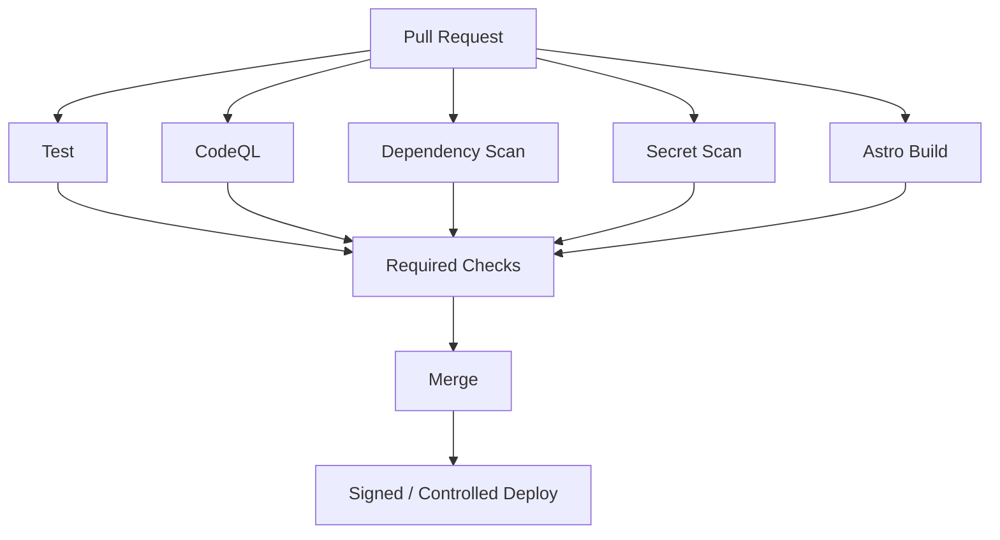

---

# 58. Testing Strategy

Required tests:

| Test | Purpose |
|---|---|
| schema validation | prevent malformed content |
| CVE regex validation | identifier correctness |
| CVSS bounds | must be 0–10 |
| EPSS bounds | must be 0–1 |
| duplicate detection | avoid repeated stories |
| URL canonicalization | dedup reliability |
| source required | factual accountability |
| missing fix handling | prevent hallucinated fixes |
| timestamps | archive correctness |
| LLM schema validation | structured output safety |
| Astro build | publishing reliability |
| broken links | source quality |
| route generation | archive correctness |

Critical invariant:

> **AI-generated data must never overwrite deterministically sourced vulnerability intelligence.**

---

# 59. Error Handling

External sources will fail.

Design collectors independently.

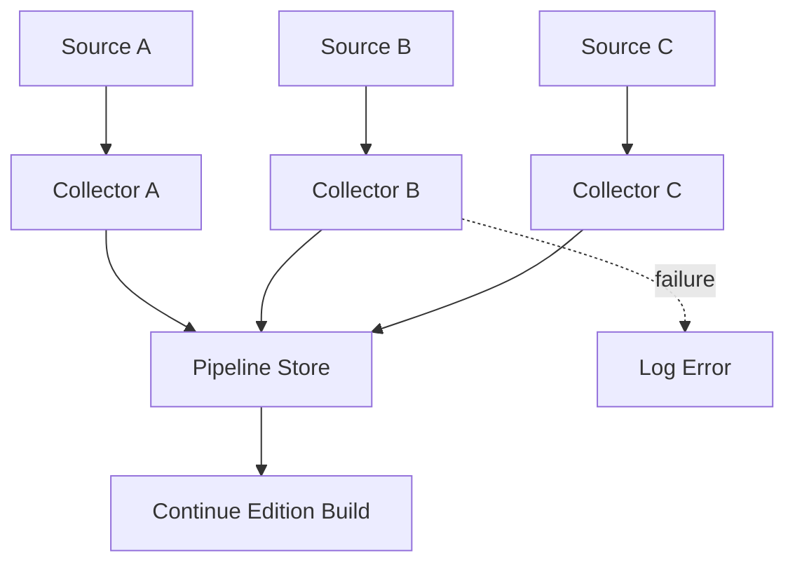

One source failure should not cancel the whole edition.

---

# 60. Observability

Pipeline telemetry should include:

```text
collector duration
collector success/failure
stories fetched
stories normalized
duplicates removed
CVEs extracted
enrichment errors
LLM errors
validation errors
stories published
build duration
```

---

# 61. Editorial Workflow

V1 does not need a CMS.

Use repository-native review.

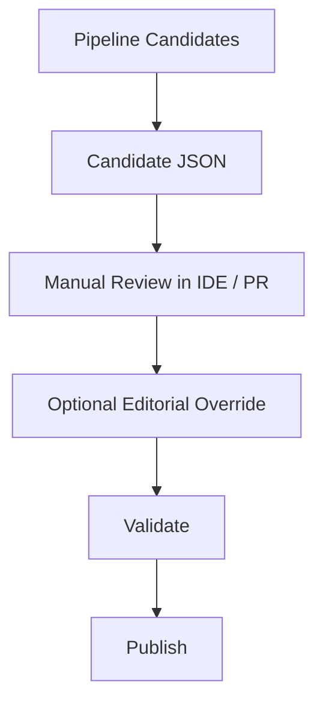

Possible override file:

```yaml
story_id: abc123

publish: true
lead_story: true

headline: "The npm Attack Security Engineers Should Understand"

category: supply-chain

editor_notes:
  - "Emphasize credential theft"

signal_override: null
```

---

# 62. Manual Editorial Overrides

Allow editors to:

```text
publish / suppress
change title
change summary
select lead story
change category
add tags
feature a story
add editor note
merge duplicates
change ordering
```

Do not allow manual edits to silently modify authoritative CVE metadata without provenance.

---

# 63. Data Retention

Because the site is archival, keep edition data permanently.

Recommended:

```text
raw source metadata      30–90 days
normalized candidates    90 days
enriched stories         long-lived
published editions       permanent
original articles        permanent
```

If the raw data volume is small, retaining more is acceptable.

---

# 64. Build-Time Rendering

The frontend should not call security APIs directly.

Preferred:

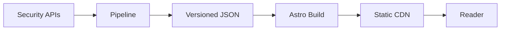

Benefits:

```text
fast
cheap
cacheable
reproducible
low attack surface
easy rollback
historical editions
```

---

# 65. Initial Deployment

Recommended first option:

```text
GitHub
↓
GitHub Actions
↓
Astro
↓
Cloudflare Pages
↓
tsd.report
```

Alternative:

```text
GitHub
↓
Vercel
```

---

# 66. DNS

Recommended:

```text
tsd.report          primary
www.tsd.report      redirect → tsd.report
```

Enable:

```text
HTTPS only
HSTS after validation
DNSSEC if registrar / DNS provider supports it
```

---

# 67. Phase 0 — Brand + UI Prototype

Goal:

> Confirm that The Security Diff visually feels right.

Build:

```text
masthead
newspaper layout
lead story
3-column cards
filters
dark mode
archive sample
fake vulnerability watch
responsive mobile layout
```

Use fixture data.

No backend.

---

# 68. Phase 1 — Static Content Model

Implement:

```text
Story TypeScript interface
Vulnerability interface
Source interface
Edition interface
SecuritySignal interface
JSON fixtures
Markdown original articles
```

Goal:

> Every page renders from data instead of hard-coded HTML.

---

# 69. Phase 2 — Automated News Collection

Implement:

```text
RSS collector
API collector
source registry
normalization
canonical URLs
basic CVE extraction
deduplication
daily candidate JSON
```

No AI yet.

Goal:

> Tomorrow's raw edition can be generated automatically.

---

# 70. Phase 3 — Vulnerability Intelligence

Add:

```text
CISA KEV
FIRST EPSS
GitHub Security Advisories
OSV
NVD
vendor advisory enrichment
CVSS
fixed versions
affected ecosystems
```

Goal:

> Turn security news into structured security intelligence.

---

# 71. Phase 4 — Editorial AI

Add:

```text
summary
why it matters
who should care
actionable summary
category
tags
headline improvement
```

Use strict schemas.

Goal:

> Generate concise newspaper-ready copy without inventing security facts.

---

# 72. Phase 5 — Original Publishing

Add:

```text
MDX
author pages
featured original articles
research notes
incident breakdowns
series support
```

Goal:

> Make TSD a publication, not just an aggregator.

---

# 73. Phase 6 — Search + CVE Pages

Add:

```text
⌘ K
CVE routes
search
related stories
tag pages
technology pages
```

Goal:

> Make historical security intelligence useful.

---

# 74. Phase 7 — Intelligence Expansion

Future:

```text
EPSS history
CVE timelines
package pages
technology pages
incident timelines
watchlists
email digest
topic-specific RSS
trend charts
```

---

# 75. Phase 8 — Personalization / Accounts

Only consider this later.

Possible:

```text
saved technologies
saved packages
custom feeds
email alerts
team feeds
```

Not needed for initial product.

---

# 76. Initial MVP Definition

The first public release should contain:

```text
Homepage
Daily edition
Archive
Category filters
Signal filters
Story pages
Original article pages
Vulnerability Watch
CVE enrichment
RSS
Responsive design
Dark mode
```

Initial automated sources:

```text
CISA KEV
FIRST EPSS
GitHub Security Advisories
OSV
NVD
selected security RSS feeds
```

---

# 77. First IDE Implementation Prompt

Use this as the first implementation task:

> Build an Astro-based static security newspaper named **The Security Diff**, served from `tsd.report`.
>
> Recreate the visual principles of a traditional newspaper rather than a modern security dashboard: warm paper background, serif typography, thin horizontal rules, dark red accent, large lead story, dense three-column secondary story layout, archive navigation, light and dark modes.
>
> Content must be driven entirely by JSON and Markdown/MDX rather than hard-coded into UI components.
>
> Implement the following routes:
>
> - `/`
> - `/today`
> - `/archive`
> - `/YYYY/MM/DD`
> - `/article/[slug]`
> - `/category/[category]`
> - `/tag/[tag]`
> - `/cve/[cve]`
>
> Define TypeScript schemas for:
>
> - `Story`
> - `Vulnerability`
> - `Source`
> - `SecuritySignal`
> - `Edition`
>
> Create fixture data containing at least 15 security stories across:
>
> - vulnerabilities
> - software supply chain
> - AI / agent security
> - AppSec
> - cloud / Kubernetes
> - research
> - security engineering
>
> Support story types:
>
> - `news`
> - `cve`
> - `research`
> - `original`
> - `incident`
> - `explainer`
> - `tool`
> - `advisory`
>
> The lead story must support:
>
> - summary
> - why it matters
> - affected technologies
> - actionable guidance
> - references
> - illustration
>
> CVE stories must support:
>
> - CVE
> - GHSA
> - CVSS
> - EPSS
> - EPSS percentile
> - CISA KEV
> - exploitation status
> - affected packages
> - affected versions
> - fixed versions
>
> Add a "Today's Vulnerability Watch" table.
>
> Add topic filters and signal filters.
>
> Add responsive desktop, tablet and mobile layouts.
>
> Use reusable components.
>
> Do not implement a backend or database yet.
>
> Include realistic fixture content so the visual result can be evaluated before implementing ingestion.

---

# 78. Second IDE Implementation Prompt

> Create a Python pipeline under `/pipeline`.
>
> The pipeline must:
>
> 1. fetch raw security source records,
> 2. normalize them,
> 3. canonicalize URLs,
> 4. extract CVE and GHSA identifiers,
> 5. identify package ecosystems where possible,
> 6. deduplicate stories,
> 7. cluster related sources into security events,
> 8. enrich vulnerability records,
> 9. rank candidates,
> 10. emit a daily Edition JSON file.
>
> Persist intermediate files under:
>
> - `data/raw`
> - `data/normalized`
> - `data/deduplicated`
> - `data/enriched`
> - `data/editions`
>
> Use Pydantic models.
>
> Each external source must fail independently.
>
> Every enriched security field must retain provenance.
>
> No LLM functionality should be introduced yet.

---

# 79. Third IDE Implementation Prompt

> Integrate vulnerability enrichment with:
>
> - CISA KEV
> - FIRST EPSS
> - GitHub Global Security Advisories
> - OSV
> - NVD
>
> Given a CVE, construct a normalized vulnerability record containing:
>
> - CVE ID
> - GHSA ID when available
> - CVSS
> - severity
> - EPSS
> - EPSS percentile
> - KEV membership
> - known exploitation state
> - affected package ecosystem
> - affected package
> - affected versions
> - fixed versions
> - CWE
> - advisory references
>
> Preserve source provenance for every field.
>
> Never overwrite a higher-authority source with a lower-authority source without an explicit merge rule.

---

# 80. Fourth IDE Implementation Prompt

> Add an editorial AI abstraction.
>
> Create:
>
> ```python
> class EditorialProvider:
>     def summarize(
>         self,
>         story,
>         evidence
>     ) -> EditorialContent:
>         ...
> ```
>
> Providers must be swappable.
>
> Support:
>
> ```text
> EDITORIAL_PROVIDER=none
> ```
>
> so that the publication remains buildable without an LLM.
>
> The LLM must receive only validated evidence and return structured JSON.
>
> It may generate:
>
> - headline
> - summary
> - why it matters
> - affected audience
> - readable actionable summary
> - category
> - tags
>
> It must never generate authoritative security fields.

---

# 81. Fifth IDE Implementation Prompt

> Add Markdown / MDX publishing for original articles, research notes, explainers, and incident breakdowns.
>
> Support:
>
> - authors
> - series
> - tags
> - categories
> - featured articles
> - related articles
> - original / research / incident labels
>
> Original articles should visually coexist with automatically generated Security Briefs on the daily newspaper homepage.

---

# 82. Definition of Done — V1

V1 is complete when:

- [ ] `tsd.report` displays the latest edition.
- [ ] Homepage resembles a technical newspaper.
- [ ] Editions are date-addressable.
- [ ] Archive works.
- [ ] Topic filters work.
- [ ] Signal filters work.
- [ ] Story pages work.
- [ ] Original articles work.
- [ ] RSS works.
- [ ] Vulnerability Watch works.
- [ ] CVE pages work.
- [ ] CVSS is deterministically sourced.
- [ ] EPSS is deterministically sourced.
- [ ] KEV is deterministically sourced.
- [ ] Fixed versions never come only from AI.
- [ ] Source attribution is visible.
- [ ] Duplicate stories are clustered.
- [ ] Site builds statically.
- [ ] Mobile layout is usable.
- [ ] Dark mode works.
- [ ] Security CI checks pass.
- [ ] Daily edition can be generated without manual coding.

---

# 83. What Makes The Security Diff Different

The core differentiator should always remain:

```text
NORMAL SECURITY NEWS

"Critical vulnerability discovered."
```

versus:

```text
THE SECURITY DIFF

What happened?
↓
CVE
↓
CVSS
↓
EPSS
↓
KEV
↓
Known exploitation?
↓
Affected technology
↓
Affected versions
↓
Fixed version
↓
Why it matters
↓
Who should care
↓
What should you do
↓
Primary sources
```

That is the product.

---

# 84. Long-Term Vision

The publication can evolve from:

```text
security newspaper
```

into:

```text
security newspaper
+
vulnerability intelligence
+
research index
+
security engineering knowledge base
+
original technical publication
```

The long-term identity should still remain editorial and readable.

Do not turn the homepage into another enterprise security dashboard.

The newspaper format is the brand.

---

# 85. North Star

The best test for every feature:

> **Does this help a security engineer understand what changed today and decide whether they need to care?**

If yes, it belongs in The Security Diff.

If not, it probably does not.

---

# 86. Final Product Statement

> **The Security Diff (`tsd.report`) is a daily security engineering newspaper that combines curated security news, vulnerability intelligence, software supply-chain incidents, AI/agent security, cloud and AppSec research, and original engineering commentary.**
>
> **Every important story should go beyond the headline and explain the evidence, affected technology, vulnerability context, EPSS, KEV status, remediation, and practical impact for security teams.**

The product should feel like **The Daily Diff for security engineering**, while developing its own identity around high-signal security intelligence and practical engineering analysis.
